# Lab0: GDB&QEMU 调试64位RISC-V LINUX
## 实验目的：
- 使用交叉编译工具，完成Linux内核代码编译
- 使用QEMU运行内核
- 熟悉GDB和QEMU联合调试

## 实验过程与代码实现
### 搭建实验环境
> 实验在vmware虚拟机上运行
1. 确定当前linux版本：运行`lsb_release -a`和`uname -m`命令，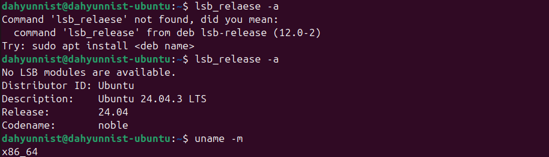查看当前linux版本为Ubuntu 24.04， 架构为x86_64，符合实验要求：
2. 更新软件包列表以确保安装最新的软件包：
   - 运行命令`sudo apt update`：
   - 运行命令`sudo apt upgrade -y`升级所有可升级软件包：
3. 安装编译内核所需要的交叉编译工具链和用于构建程序的软件包：
   - 运行命令`sudo apt install gcc-riscv64-linux-gnu`安装RISC-V 64位架构的交叉编译器 
   - 安装所需的构建工具链，数学与底层库和辅助工具:
        ```bash
        sudo apt install  autoconf automake autotools-dev curl libmpc-dev libmpfr-dev libgmp-dev \
        gawk build-essential bison flex texinfo gperf libtool patchutils bc \
        zlib1g-dev libexpat-dev git
        ```
        <!-- 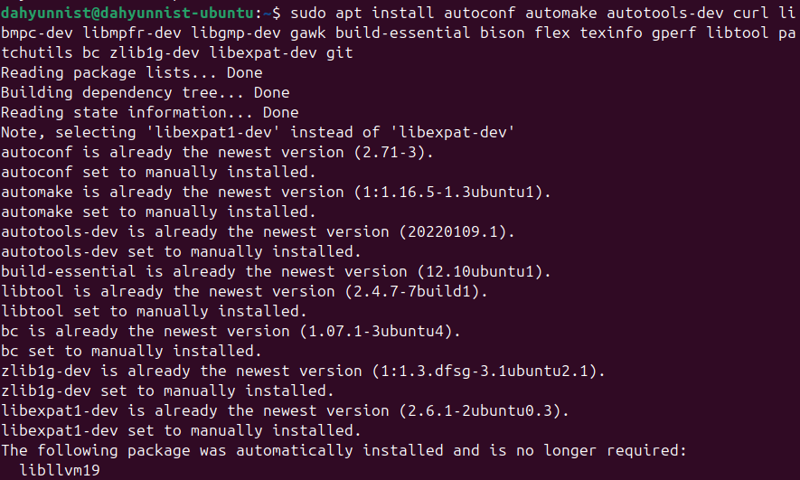
        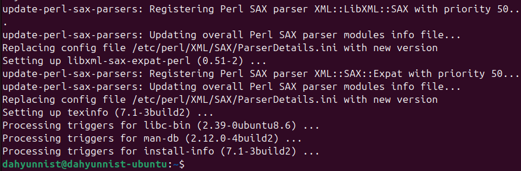 -->
4. 安装用于启动riscv64平台上的内核的模拟器`qemu`
   - 运行命令`sudo apt inatsll qemu-system-misc`: 
5. 安装多架构`gdb`用于对在`qemu`上运行的Linux内核进行调试：
   - 运行命令`sudo apt install gdb-multiarch`：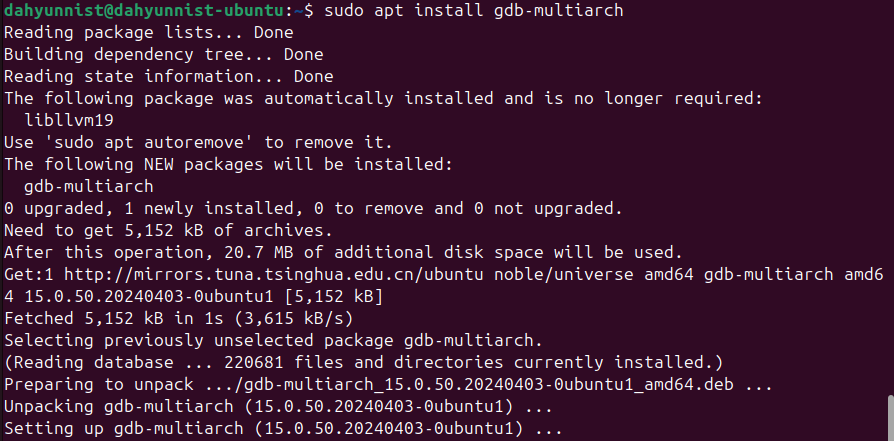

### 获取Linux源码和已经编译好的文件系统
1. 从 [https://www.kernel.org](https://www.kernel.org) 下载最新的 Linux 源码，放置在`/home/dahyunnist/os/linux`路径下
2. 克隆课程仓库至`/home/dahyunnist/os`路径下并验证根文件系统镜像(`os-25fall/src/la0/rootfs.img`): 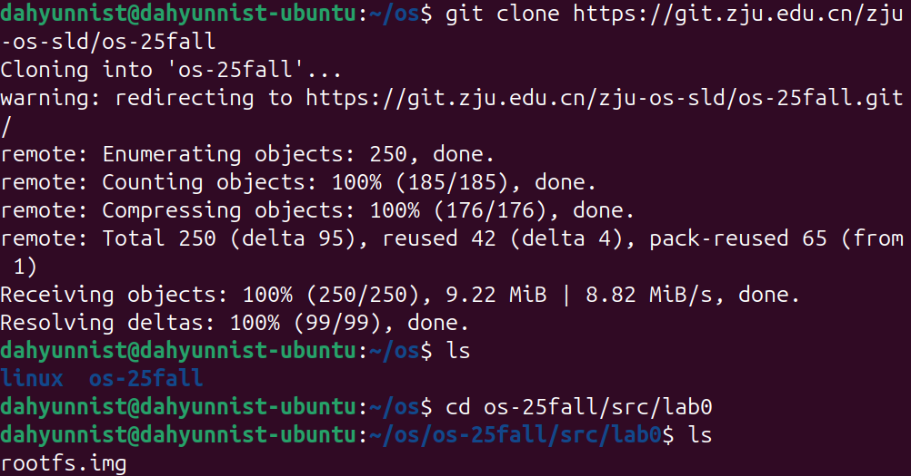

### 编译Linux内核
1. 使用默认配置：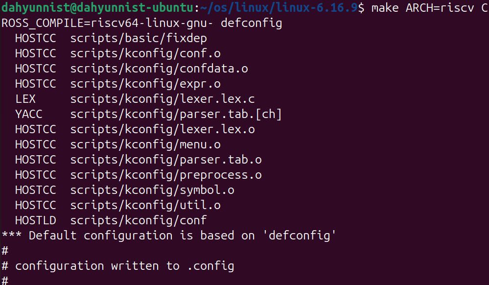
2. 运行命令`make ARCH=riscv CROSS_ComPILE=riscv64-linux-gnu- -j$(nproc)`开始编译，编译后生成内核镜像：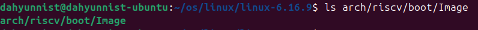

### 使用QEMU运行内核
1. 运行命令：
   ```bash
   $ qemu-system-riscv64 \
      -nographic \
      -machine virt \
      -kernel ~/os/linux/linux-6.16.9/arch/riscv/boot/Image \
      -device virtio-blk-device,drive=hd0 \
      -append "root=/dev/vda ro console=ttyS0" \
      -bios default \
      -drive file=~/os/os-25fall/src/lab0/rootfs.img,format=raw,id=hd0 #使用lab0/rootfs.img作为根文件系统
   ```
   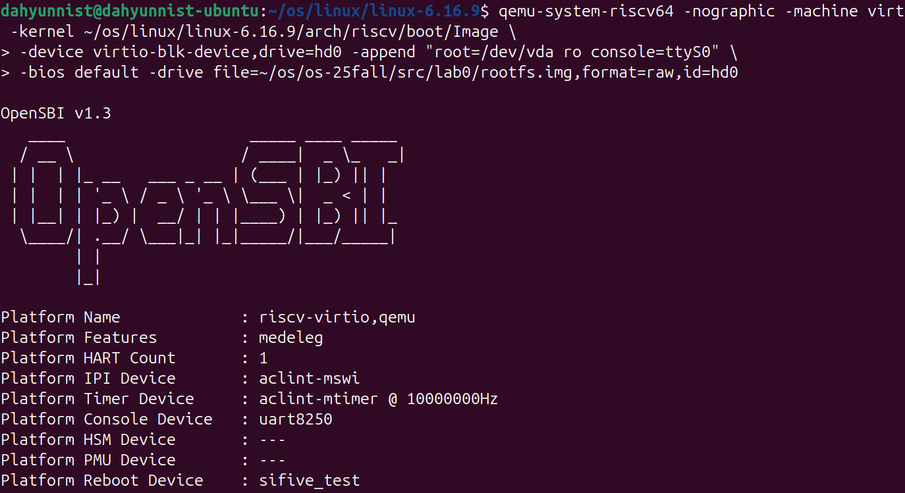 
2. 使用`uname -a`命令查看当前架构的确为riscv64：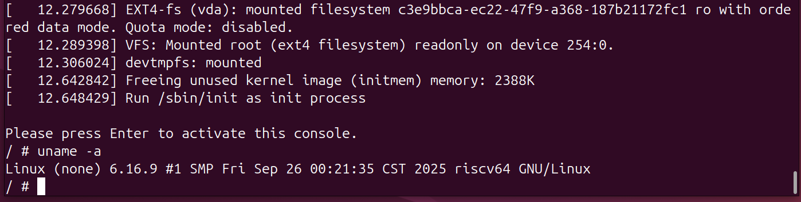

### 使用GDB对内核进行调试
1. 终端1启动qemu，执行如下命令：
   运行命令：
   ```bash
   $ qemu-system-riscv64 \
      -nographic \
      -machine virt \
      -kernel ~/os/linux/linux-6.16.9/arch/riscv/boot/Image \
      -device virtio-blk-device,drive=hd0 \
      -append "root=/dev/vda ro console=ttyS0" \
      -bios default \
      -drive file=~/os/os-25fall/src/lab0/rootfs.img,format=raw,id=hd0 -S -s
   ```
   其中`-S`参数表示**启动时暂停CPU执行**，`-s`是`-gdb tcp::1234`的简写，表示**在1234端口启动gdb服务器，等待调试连接**。
2. 终端2启动gdb并连接
   - 执行`gdb-multiarch ~/os/linux/linux-6.16.9/vmlinux`
   - 启动后执行命令`target remote :1234`，连接qemu的gdb服务器（端口1234）：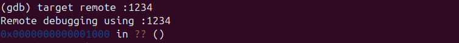
   - 执行命令`b start_kernel`，在`kernel/init/main.c`的`start_kernel`函数设置断点：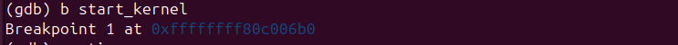
   - 执行命令`continue`，两终端输出如下：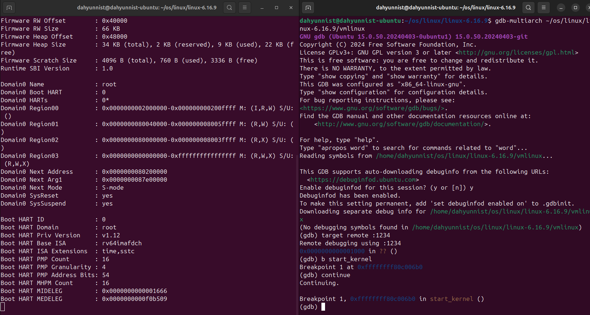可以看到GDB在start_kernel函数处触发了断点，QEMU终端在输出OpenSBI信息后停止，未继续输出内核日志。
   - 执行命令`quit`，gdb退出：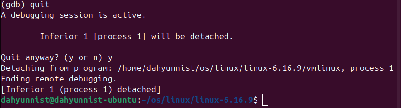   qemu终端继续输出内核日志并进入用户态：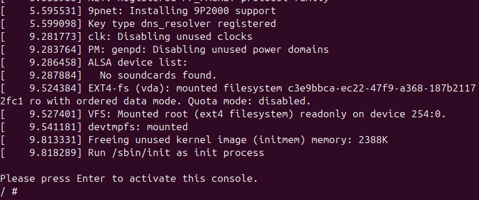

## 实验结果与分析
分步运行结果如前文所述。经过环境配置，可以成功启动qemu并运行linux内核
并且可以成功对内核进行gdb调试

## 实验中遇到的问题及解决方法
执行实验文档涵盖的操作时未遇到较大问题，但是在实验之外，由于未预留足够的虚拟机磁盘空间，导致虚拟机无法正常启动gdm.service，影响了实验进度。
#### 问题描述：
开机后反复提示登录，或是直接出现终端式界面，提示`Failed to start gdm.service - GNOME Display Manager.` 如图：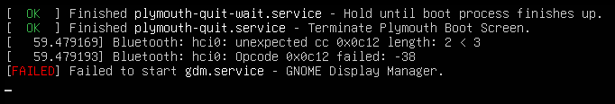
#### 解决方案
1. 给虚拟机磁盘扩展空间：参考了[csdn上的教程](https://blog.csdn.net/hktkfly6/article/details/123302335)
2. 启动虚拟机，由于还未分区，所以此时仍然会出现终端式界面并提示`Failed to start gdm.service - GNOME Display Manager.`，此时按下<kbd>Ctrl+Alt+F4</kbd>进入命令行界面(24.04版本结尾是4所以按<kbd>f4</kbd>): 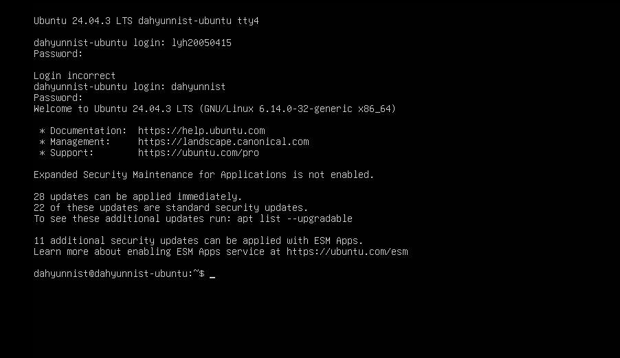
3. 执行以下命令查看磁盘使用情况和分区状况
   ```bash
   # 查看磁盘空间使用
   df -h
   # 查看磁盘分区表
   lsblk
   ```
   结果如图：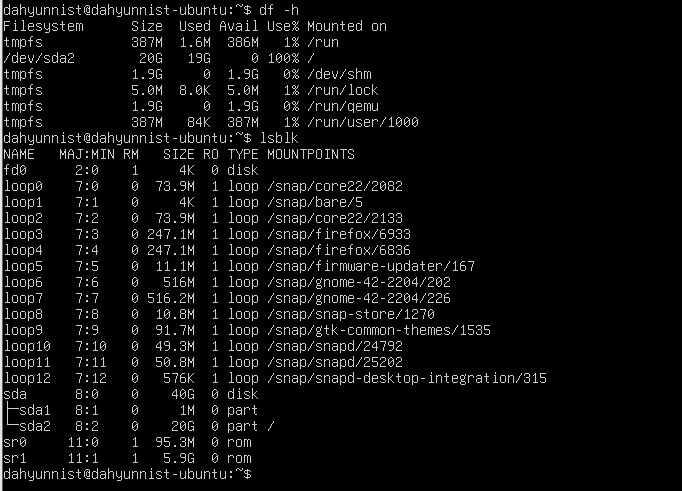 可知`/dev/sda`磁盘空间有40G，但是`sda2`只有20G，且处于`100%`使用状态
4. 查看未分配空间的具体位置：
   ```bash
   fdisk -l /dev/sda
   ```
5. 使用`fdisk`扩展`/dev/sda2`分区：
   ```bash
   sudo fdisk /dev/sda
   ```
   会出现`Command (m for help):`，随后：
    1. 删除现有根分区：输入`d`回车，提示`Partition number (1,2, default 2)`，输入`2`回车(仅删除分区表中的`/dev/sda2`记录，不会删除实际数据，但需要后续正确重建分区)
    2. 重建根分区：
        - 输入`n`回车（新建分区，若提示`Partition type`直接回车默认`Primary`）
        - 提示`Partition number (2-4, deault 2):`，输入`2`回车
        - 提示`First sector (xxxxx-xxxxx, default xxxxx):`，**输入此前第4步查看到的`sda2`起始位置**
        - 提示`Last sector`，回车默认扩展到磁盘末尾
        - 提示`Do you want to remove the signature? [Y]es/[N]o:`，输入`n`回车，保留ext4签名（`ext4 signature`是文件系统的身份标识，记录了`/dev/sda2`是一个已格式化的ext4分区（包含系统和数据），如果删除，则相当于格式化分区表记录，后续无法识别分区中的数据，即数据彻底丢失）
        - 提示`Command (m for help):`输入`w`回车，保存并退出
    3. 完整流程如图： 
    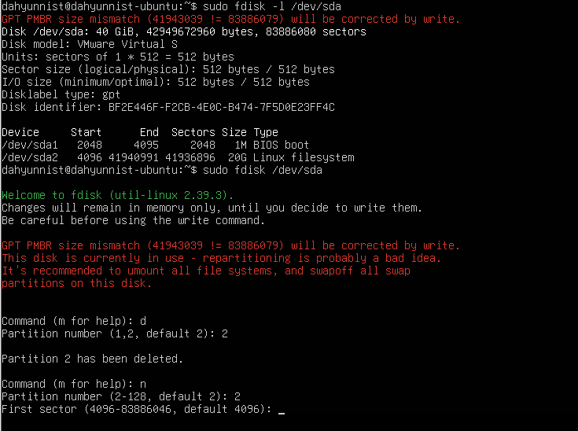 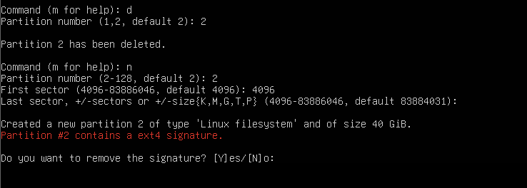 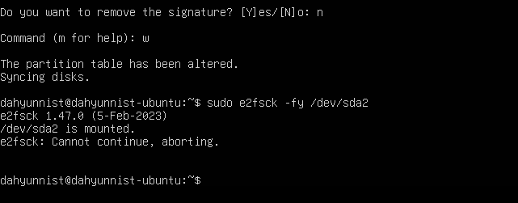
6. 将ext4文件系统扩展到分区最大容量
   ```bash
   sudo resize2fs /dev/sda2
   ```
   并检查：
   ```bash
   df -h /
   ```
   结果如图：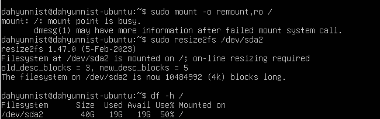
   可以看到扩展成功
7. 重启GDM服务：
   ```bash
   sudo systemctl restart gdm.service
   ```
   可以重新进入图形化登录界面，正常开机。

## 思考题与心得体会
1. 使用`riscv64-linux-gnu-gcc`编译单个`.c`文件
   - 新建一个计算阶乘的test.c文件：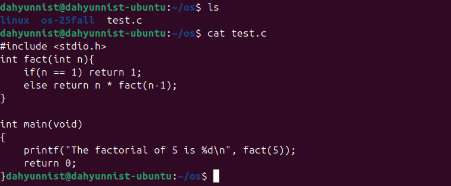
   - 执行命令`riscv64-linux-gnu-gcc -o test test.c`进行编译
2. 使用 `riscv64-linux-gnu-objdump` 反汇编 1 中得到的编译产物
   - 执行命令`riscv64-linux-gnu-objdump -d test > test.dis`进行反编译，并查看反编译结果：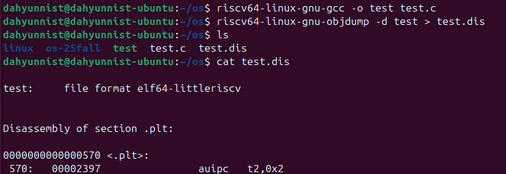 其中主要部分(`fact`函数和`main`函数)为：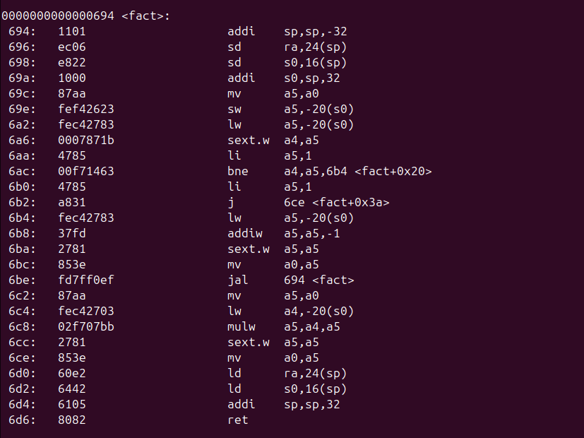 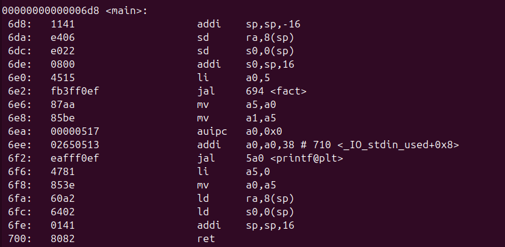
3. 调试 Linux 时:
    1. 尝试使用 GDB 的各项命令（如 `backtrace`, `finish`, `frame`, `info`, `break`, `display`, `next`, `layout` 等）。
      尝试结果如下：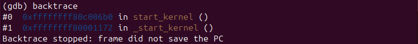 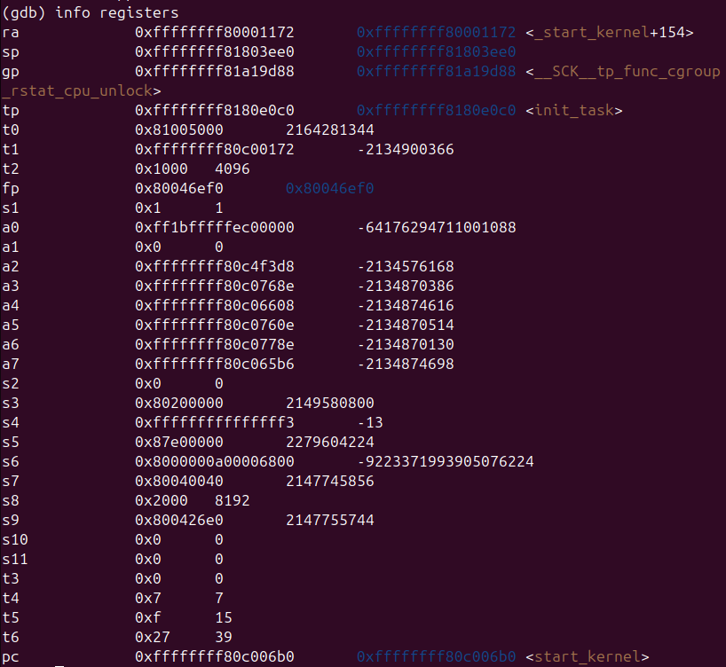 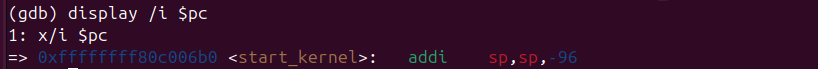 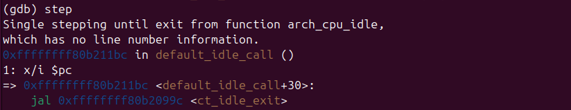
    2. 在 GDB 中查看汇编代码（不使用任何插件的情况下）
    3. 在 `0x80000000` 处下断点
    4. 查看所有已下的断点
    5. 在 `0x80200000` 处下断点
    6. 清除 `0x80000000` 处的断点
    7. 继续运行直到触发 `0x80200000` 处的断点
    8. 单步调试一次
    9.  退出 QEMU 
   2-4完整过程如下：
   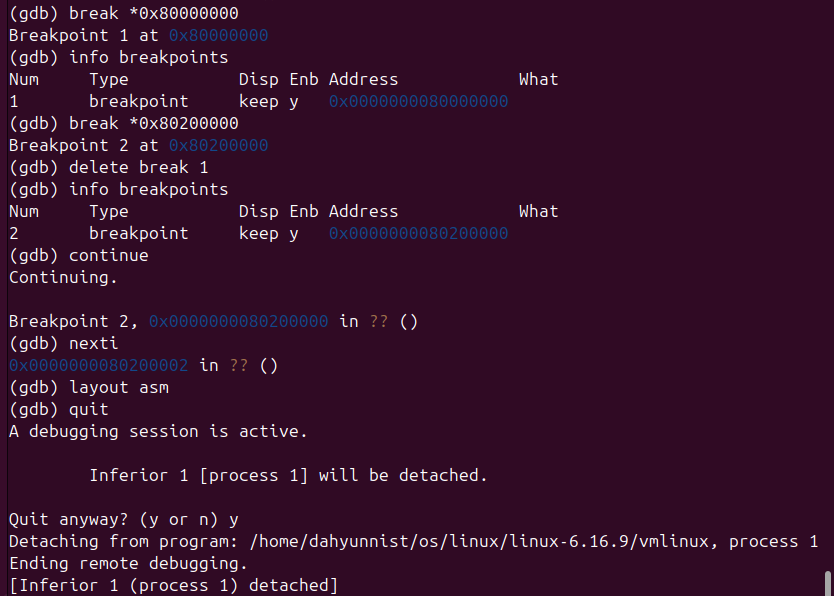

4. 使用 `make` 工具清除 Linux 的构建产物：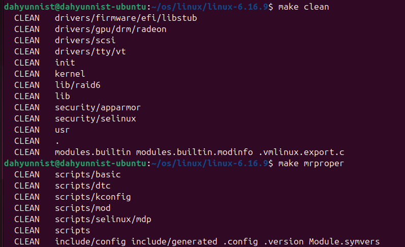

5. `vmlinux` 和 `Image` 的关系和区别是什么？
   - 关系：`Image`是`vmlinux`在Linux内核编译时经过`objcopy`转换处理后形成的二进制内核映像
   - 区别：
     - `vmlinux`是`elf`格式，而`Image`是二进制格式
     - `vmlinux`中除二进制代码外还包含完整符号和调试信息，而`Image`中只包含二进制数据
     - `vmlinux`可用于调试和定位内核问题，不能直接引导Linux系统启动；而`Image`正相反

<!-- ## 对实验指导的建议 -->

