## Lab 1: RV64 内核引导与时钟中断处理
### 实验具体过程与代码实现
#### RV64内核引导
1. **完善Makefile脚本**：参考实验框架中其他Makefile文件，将`lib/Makefile`补全如下：
   ```Makefile
    C_SRC = $(sort $(wildcard *.c)) # 所有.c文件
    OBJ = $(patsubst %.c, %.o, $(C_SRC)) # 所有.c文件对应的编译后的.o文件

    all: $(OBJ) # all规则，编译所有.o文件

    %.o: %.c 
        ${GCC} ${CFLAG} -c $<

    clean: # clean规则，删除所有编译产物
        $(shell rm *.o 2>/dev/null)
   ```

2. **编写`head.S`**：为即将运行的第一个C函数设置程序栈（栈的大小设置为 4KiB），并将该栈放置在 `.bss.stack` 段。接下来我们只需要通过跳转指令，跳转至 `main.c` 中的 `start_kernel` 函数即可。文件编写如下：
    ```asm
        .extern start_kernel
        .section .text.entry
        .globl _start
    _start:
        la sp, boot_stack_top # 将boot_stack_top地址加载入sp
        j start_kernel # 跳转至start_kernel函数

        .section .bss.stack
        .globl boot_stack
    boot_stack:
        .space 4096 # 设置栈大小为4kb

        .globl boot_stack_top
    boot_stack_top:
    ```
3. **补充`sbi.c`**：`sbi.c`中的各函数主要承担调用OpenSBI接口，从而实现字符串输入输出等功能，其中`sbi_ecall`函数是最重要的，其先根据规范将各参数(`eid`, `fid`, `arg[0-5]`)放入相应寄存器，而后通过`ecall`指令使系统进入M模式，从而令OpenSBI完成相关操作，实现预期功能。其代码实现如下：
    ```c
    struct sbiret sbi_ecall(uint64_t eid, uint64_t fid,
                            uint64_t arg0, uint64_t arg1, uint64_t arg2,
                            uint64_t arg3, uint64_t arg4, uint64_t arg5) {
        struct sbiret res = {0, 0};
        uint64_t error;
        uint64_t value;
        asm volatile(
            // 将 eid（Extension ID）放入寄存器 a7 中，fid（Function ID）放入寄存器 a6 中，将 arg[0-5] 放入寄存器 a[0-5] 中。
            "mv a7, %[eid]\n"
            "mv a6, %[fid]\n"
            "mv a0, %[arg0]\n"
            "mv a1, %[arg1]\n"
            "mv a2, %[arg2]\n"
            "mv a3, %[arg3]\n"
            "mv a4, %[arg4]\n"
            "mv a5, %[arg5]\n"
            // 使用 ecall 指令，OpenSBI根据参数完成相关操作
            "ecall\n"
            // OpenSBI 的返回结果会存放在寄存器 a0，a1 中，其中 a0 为 error code，a1 为返回值
            "mv %[error], a0\n"
            "mv %[value], a1\n"
            : [error] "=r" (error), [value] "=r" (value) // 使用error和value作为输出，接受OpenSBI 的返回值
            : [eid] "r" (eid), [fid] "r" (fid), [arg0] "r" (arg0), [arg1] "r" (arg1), [arg2] "r" (arg2), [arg3] "r" (arg3), [arg4] "r" (arg4), [arg5] "r" (arg5)
            : "memory", "a0", "a1", "a2", "a3", "a4", "a5", "a6", "a7" // 提醒可能受到影响的寄存器
        );
        // 以sbiret的形式返回
        res.error = error;
        res.value = value;
        return res;
    }
    ```
    - `sbi.c`中其余功能函数都可通过调用`sbi_ecall`函数，传入不同的`eid`, `fid`, `arg[0-5]`实现功能。如`sbi_system_reset`函数(`test.c`中在 kernel 运行的结尾会调用 `sbi_system_reset(0, 0)` 来 shutdown)实现如下：
    ```c
    struct sbiret sbi_system_reset(uint32_t reset_type, uint32_t reset_reason) {
        return sbi_ecall(0x53525354, 0, reset_type, reset_reason, 0, 0, 0, 0); 
        // sbi_system_reset的eid为0x53525354，fid为0
    }
    ``` 
4. **修改defs**：补充`arch/riscv/include/defs.h`中`read_csr`的宏定义：
    ```c
    #define csr_read(csr)                   \
    ({                                    \
        uint64_t __v;                       \
        asm volatile("csrr %0, " #csr: "=r"(__v)::"memory");\ 
        //%0代表输入输出部分第一个符号，即__v，#csr将csr进行宏替换
        __v;                                \
    })
    ```
    完成后执行`make run`，程序成功打印出了欢迎信息并退出：

#### RV64 时钟中断处理
1. **准备工作**，修改`vmlinux.lds`，使其最先链接`.text.init`段，而后`.text.entry`段（中断处理程序）；同时修改`head.S`，其中代码归入`.text.init`段
2. **开启trap处理**：修改`head.S`，补全`_start`中的逻辑，使其在跳转至`start_kernel`之前，先对CSR寄存器进行初始化，开启时钟中断并设置第一次时钟中断：
    ```asm
        .extern start_kernel
        .extern _traps
        .extern clock_set_next_event
        .section .text.init
        .globl _start
    _start:
        # (previous) initialize stack
        la sp, boot_stack_top

        # 将 _traps所表示的地址写入 stvec
        la t0, _traps
        csrw stvec, t0
        # 开启时钟中断，将 sie[STIE] 置 1
        li t1, (1 << 5)
        csrs sie, t1
        # 设置第一次时钟中断
        call clock_set_next_event
        # 开启 S 态下的中断响应，将 sstatus[SIE] 置 1
        li t1, (1 << 1)
        csrs sstatus, t1
        
        # jump to start_kernel
        j start_kernel
    ```
3. **实现上下文切换**：在`arch/riscv/kernel/entry.S`中实现上下文切换机制，主要步骤为：保存寄存器值到栈上——传入参数启动trap处理——处理完成，恢复寄存器值——返回。代码实现如下：
    ```asm title="arch/riscv/kernel/entry.S"
        .extern trap_handler
        .section .text.entry
        .align 2
        .globl _traps
    _traps:
        # 1. 将32个寄存器和sepc值保存到栈上
    _save_context:
        addi sp, sp, -264
        sd x0, 0(sp)
        sd x1, 8(sp)
        sd x3, 24(sp)
        sd x4, 32(sp)
        sd x5, 40(sp)
        sd x6, 48(sp)
        sd x7, 56(sp)
        sd x8, 64(sp)
        sd x9, 72(sp)
        sd x10, 80(sp)
        sd x11, 88(sp)
        sd x12, 96(sp)
        sd x13, 104(sp)
        sd x14, 112(sp)
        sd x15, 120(sp)
        sd x16, 128(sp)
        sd x17, 136(sp)
        sd x18, 144(sp)
        sd x19, 152(sp)
        sd x20, 160(sp)
        sd x21, 168(sp)
        sd x22, 176(sp)
        sd x23, 184(sp)
        sd x24, 192(sp)
        sd x25, 200(sp)
        sd x26, 208(sp)
        sd x27, 216(sp)
        sd x28, 224(sp)
        sd x29, 232(sp)
        sd x30, 240(sp)
        sd x31, 248(sp)
        addi t0, sp, 264
        sd t0, 16(sp)
        # 此处保存的是sp原本的值
        csrr t1, sepc
        sd t1, 256(sp)

        # 2. 开启中断，传入参数启动trap处理
    _call_handler:
        csrr a0, scause
        csrr a1, sepc
        call trap_handler

        # 3. 恢复sepc和32个寄存器，为了保证栈地址正确，需要最后恢复sp
    _restore_context:
        ld t1, 256(sp)
        csrw sepc, t1
        ld x0, 0(sp)
        ld x1, 8(sp)
        ld x3, 24(sp)
        ld x4, 32(sp)
        ld x5, 40(sp)
        ld x6, 48(sp)
        ld x7, 56(sp)
        ld x8, 64(sp)
        ld x9, 72(sp)
        ld x10, 80(sp)
        ld x11, 88(sp)
        ld x12, 96(sp)
        ld x13, 104(sp)
        ld x14, 112(sp)
        ld x15, 120(sp)
        ld x16, 128(sp)
        ld x17, 136(sp)
        ld x18, 144(sp)
        ld x19, 152(sp)
        ld x20, 160(sp)
        ld x21, 168(sp)
        ld x22, 176(sp)
        ld x23, 184(sp)
        ld x24, 192(sp)
        ld x25, 200(sp)
        ld x26, 208(sp)
        ld x27, 216(sp)
        ld x28, 224(sp)
        ld x29, 232(sp)
        ld x30, 240(sp)
        ld x31, 248(sp)
        ld x2, 16(sp)

        # 4.返回
    _trap_return:
        sret
    ```
4. **实现trap处理函数**：在`arch/riscv/kernel/trap.c`中实现trap处理函数`trap_handler()`，其主要功能为根据trap类型输出相应信息：
    ```c
    #include "stdint.h"
    #include "clock.h"
    #include "printk.h"

    void trap_handler(uint64_t scause, uint64_t sepc) {
        // 通过 `scause` 判断 trap 类型
        if(scause & 0x8000000000000000){ //interrupt
            // 如果是 interrupt 判断是否是 timer interrupt
            if(scause == 0x8000000000000005){ 
                // 是 timer interrupt 则打印输出相关信息，并通过 `clock_set_next_event()` 设置下一次时钟中断
                printk("[S] Supervisor Mode Timer Interrupt\n");
                clock_set_next_event();
            }
            // 其他interrupt也打印出来了，供以后调试
            else if(scause == 0x8000000000000001){
                printk("[S] Supervisor software Interrupt(Not handled yet)\n");
            }
            else if(scause == 0x8000000000000009){
                printk("[S] Supervisor external Interrupt(Not handled yet)\n");
            }
            else if(scause == 0x800000000000000D){
                printk("[S] Counter-overflow Interrupt(Not handled yet)\n");
            }
            else{
                printk("[S] Other interruptions(Not handled yet)\n");
            }
        }
        // 其他exception
        else{  // Exception
            if(scause == 0x0000000000000002){
                printk("[S] Illegal instruction(Not handled yet)\n");
            }
            else{
                printk("[S] Other exceptions(Not handled yet)\n");
            }
        }
        
    }
    ```
5. **实现时钟中断相关函数**：在`arch/riscv/kernel/clock.c`中实现`get_cycles()`函数（获取时间）和`clock_set_next_event()`函数（设置下一个时钟中断事件）：
    ```c
    #include "stdint.h"
    #include "sbi.h"

    // QEMU 中时钟的频率是 10MHz，也就是 1 秒钟相当于 10000000 个时钟周期
    uint64_t TIMECLOCK = 10000000;

    uint64_t get_cycles() {
        // 编写内联汇编，使用 rdtime 获取 time 寄存器（即 mtime 寄存器）的值并返回
        uint64_t time = 0;
        asm volatile(
            "rdtime %[time]\n"
            : [time] "=r" (time)
            :
            : "memory"
        );
        return time;
    }

    void clock_set_next_event() {
        // 下一次时钟中断的时间点
        uint64_t next = get_cycles() + TIMECLOCK;
        // 使用 sbi_set_timer 来完成对下一次时钟中断的设置
        sbi_set_timer(next);
    }
    ```
6. **修改test函数**：设置循环，每隔一段时间打印一次信息，使得kernel持续运行；同时还能形成正常信息和中段信息交替出现的效果，从而使中断更容易观察：
    ```c
    #include "printk.h"

    void test() {
        int i = 0;
        while (1) {
            if ((++i) % 50000000 == 0) {
                printk("kernel is running!\n");
                i = 0;
            }
        }
    }
    ```
7. **编译运行**：运行结果符合预期：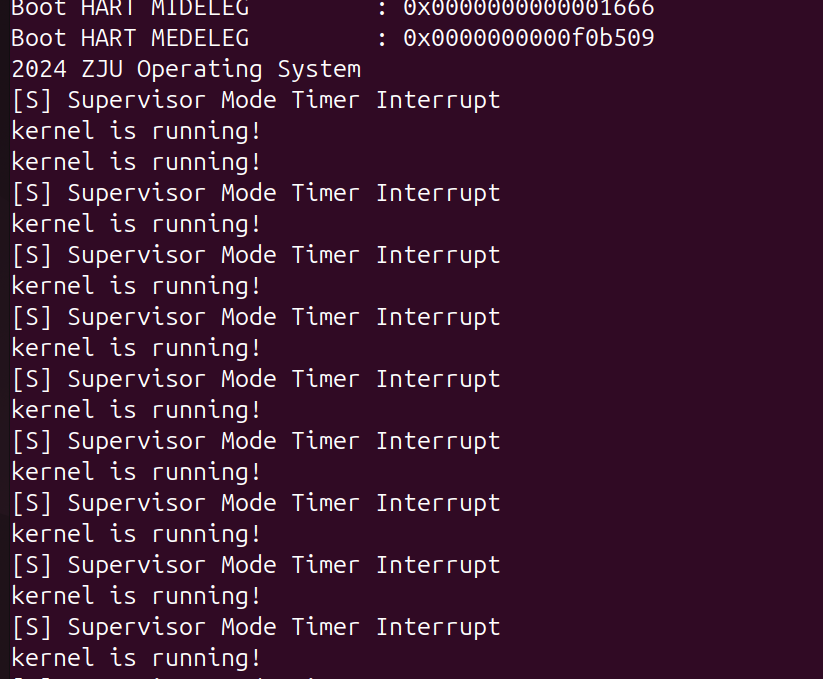


### 实验结果与分析
1. 程序运行：程序运行后成功实现了正常信息和中段信息交替出现的效果：
2. 中断机制检验：运用gdb调试工具，验证了中断机制的正确实现：
   - 开启trap处理处，`stvec`, `sie`, `sstatus`的值设置正常：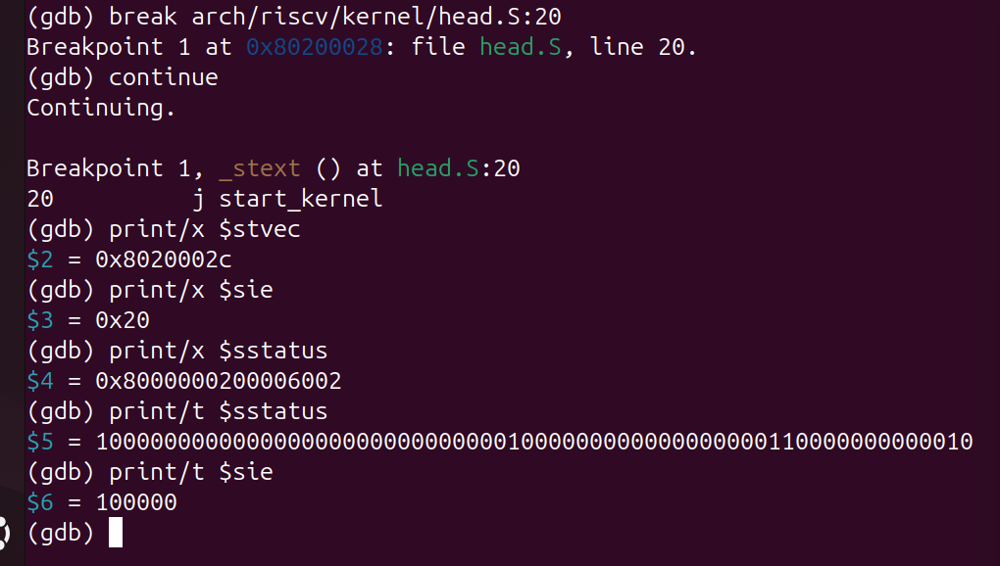
   - 上下文切换前后，寄存器值正确保存与恢复：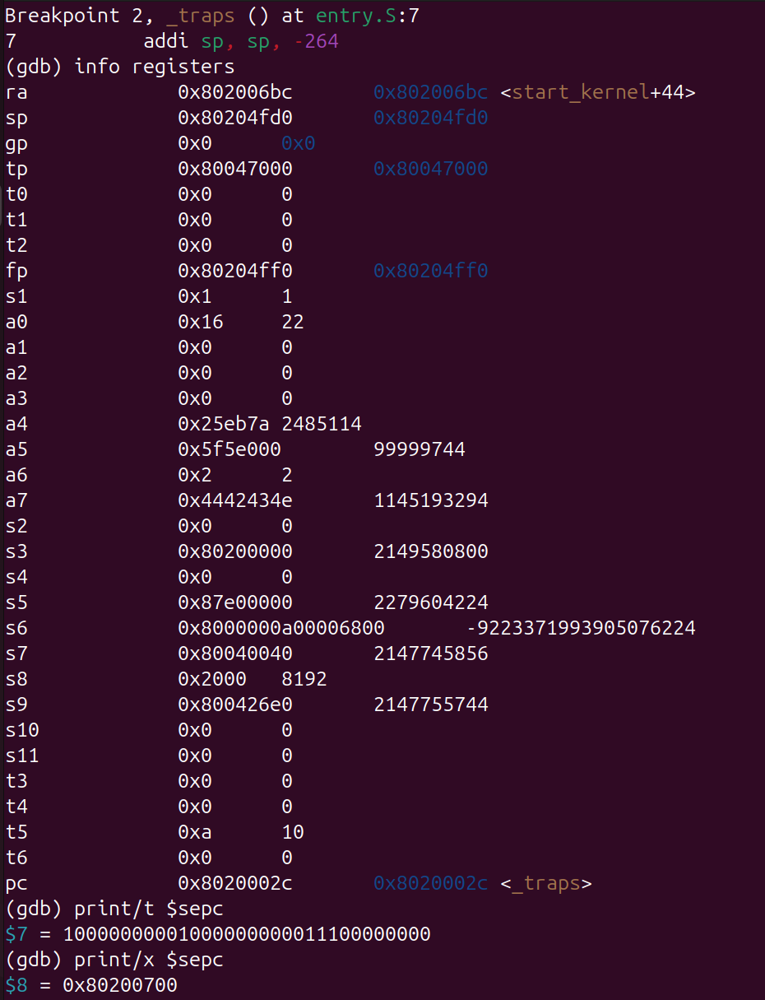(上下文切换前)<br/>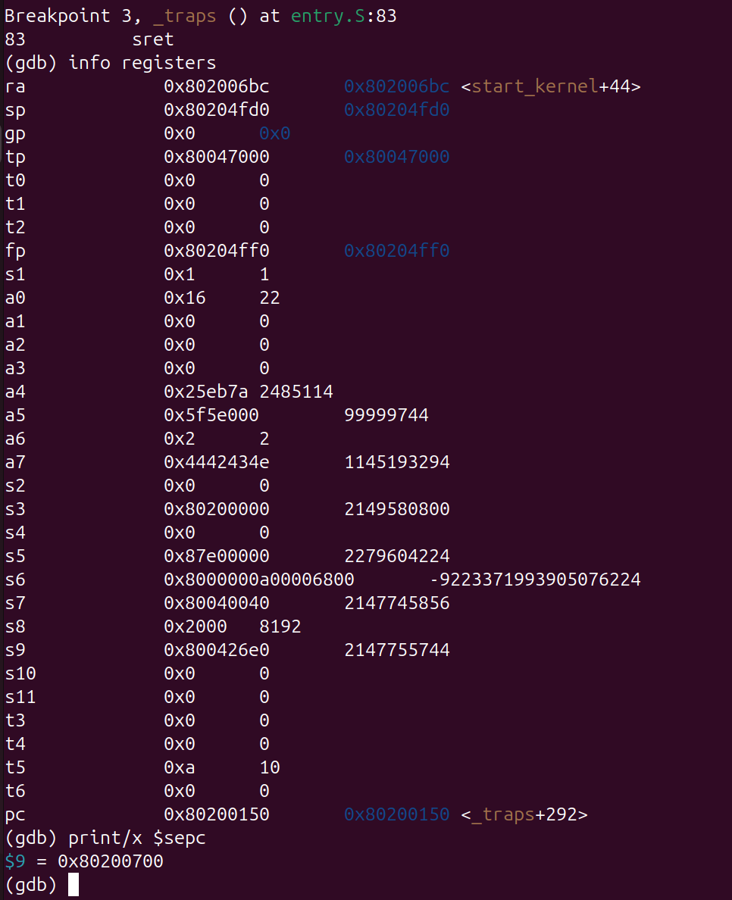(上下文切换后恢复)<br/>
   - `ecall`前后受影响寄存器的值变化正常：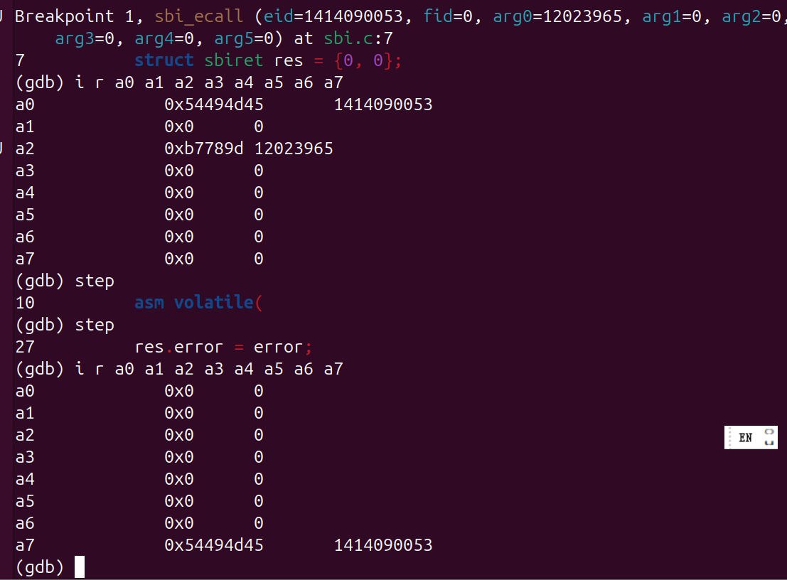


### 实验中遇到的问题及解决方法
本次实验遇到的主要问题是在编写汇编及内联汇编部分。因为riscv汇编知识遗忘较多，所以刚上手时举步维艰。后来通过复习之前笔记和查阅riscv相关手册，逐渐克服。

### 思考题与心得体会
#### 思考题
1. 请总结一下 RISC-V 的 calling convention，并解释 Caller / Callee Saved Register 有什么区别？
   - RISC-V 的 calling convention：根据调用约定，32个寄存器分为以下5类：
     - 参数寄存器（`a0`-`a7`）：传递函数参数，其中`a0`-`a1`存放函数返回值
     - 临时寄存器（`t0`-`t6`）：存放临时变量，供函数内部临时使用，旧值无需保存
     - 保存寄存器（`s0`-`s11`）
     - 返回地址寄存器（`ra`）：存储函数的返回地址，由caller保存
     - 栈指针寄存器（`sp`）：指向栈顶
     - 全局指针寄存器（`gp`）
   - Caller / Callee Saved Register 的区别：
     - Caller Saved Register包括`a0`-`a7`, `t0`-`t6`, `ra`，其值在调用函数前保存，且被调用者可以自由修改
     - Callee Saved Register包括`s0`-`s11`, `gp`，其值由callee在使用寄存器之前保存，并在返回前恢复
2. 编译之后，通过 System.map 查看 vmlinux.lds 中自定义符号的值并截图。
   - 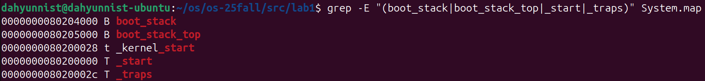
3. 用 `csr_read` 宏读取 `sstatus` 寄存器的值，对照 RISC-V 手册解释其含义并截图。
   - 尝试如下：
   ```c
    void test() {
        uint64_t sstatus_val = csr_read(sstatus);
        printk("sstatus = 0x%llx\n", sstatus_val);
        sbi_system_reset(SBI_SRST_RESET_TYPE_SHUTDOWN, SBI_SRST_RESET_REASON_NONE);
        __builtin_unreachable();
    }
   ``` 
   结果如图：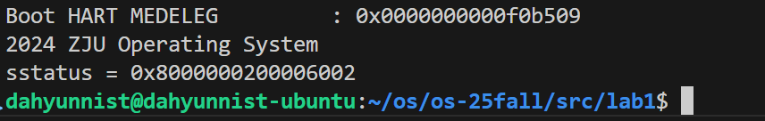<br/>查阅RISC-V 手册，可知其SIE位为1（Supervisor中断已启用），SPIE位为1（之前的中断状态为启用），UBE位为1（系统使用小端字节序），SUM位为1（Supervisor 可以访问用户内存页面），SD位为1（存在需要保存的扩展状态）
4. 用 `csr_write` 宏向 `sscratch` 寄存器写入数据，并验证是否写入成功并截图。
   - 尝试向 `sscratch` 寄存器写入0x00005685：
   ```c
    void test() {
        uint64_t test_val = 0x00005685;
        csr_write(sscratch, test_val)
        uint64_t sscratch_val = csr_read(scratch);
        printk("sscratch = 0x%llx\n", sscratch_val);
        sbi_system_reset(SBI_SRST_RESET_TYPE_SHUTDOWN, SBI_SRST_RESET_REASON_NONE);
        __builtin_unreachable();
    }
   ``` 
   结果如图：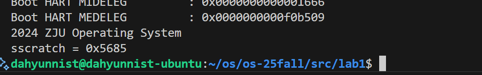
5. 详细描述你可以通过什么步骤来得到 `arch/arm64/kernel/sys.i`，给出过程以及截图。
   1. 安装ARM64交叉编译器：运行命令`sudo apt install gcc-aarch64-linux-gnu binutils-aarch64-linux-gnu` 
   2. 使用lab0下载的linux源码，配置ARM64架构：运行命令`make ARCH=arm64 defconfig`：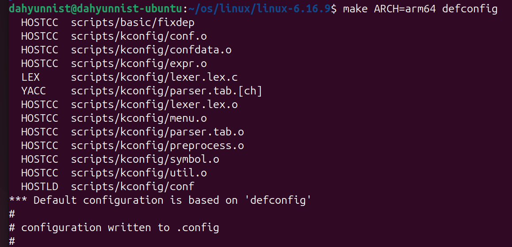
   3. 生成`sys.i`文件：运行命令`make ARCH=arm64 CROSS_COMPILE=aarch64-linux-gnu- arch/arm64/kernel/sys.i`：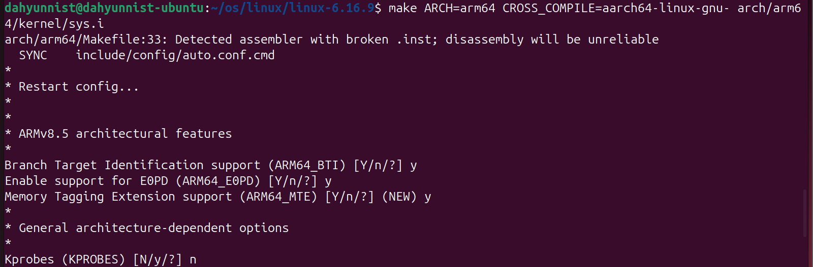
   4. 查看生成结果：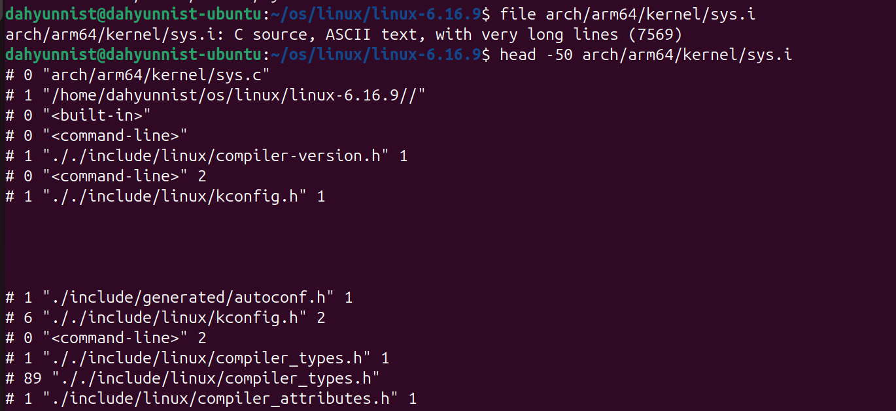
6. 寻找 Linux v6.0 中 ARM32 RV32 RV64 x86_64 架构的系统调用表；
    - 请列出源代码文件，展示完整的系统调用表（宏展开后），每一步都需要截图。
      - 列出源代码文件：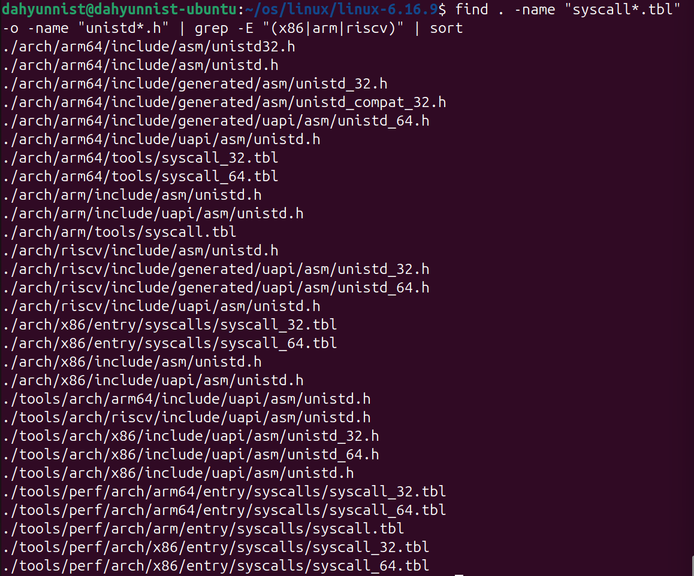
      - 查看系统调用表：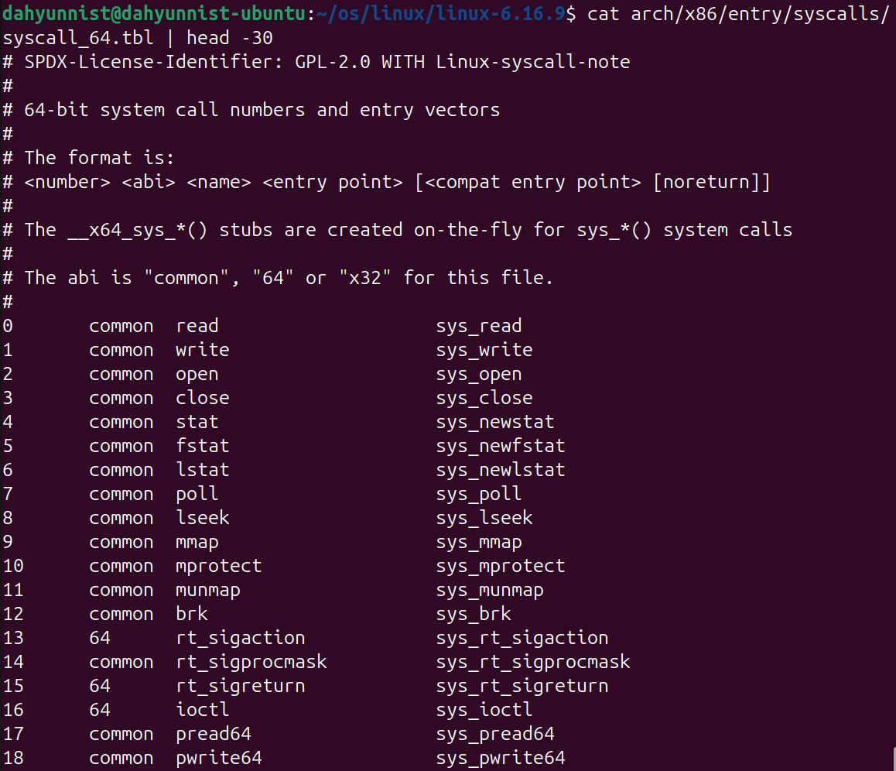 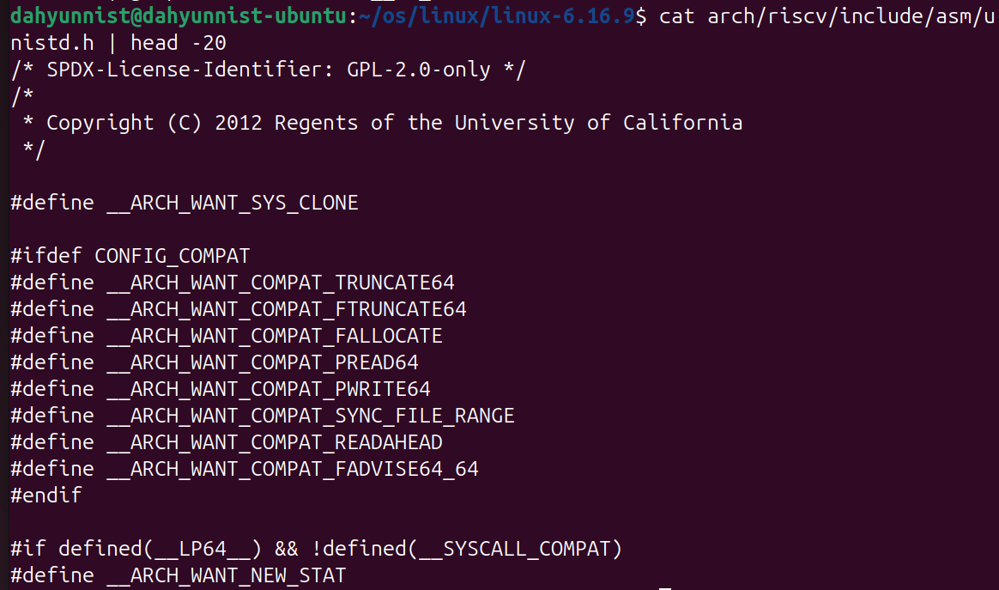
7. 阐述什么是 ELF 文件？尝试使用 readelf 和 objdump 来查看 ELF 文件，并给出解释和截图。
    - **“什么是 ELF 文件”**：ELF文件是一种用于二进制文件、可执行文件、目标代码、共享库和核心转储格式文件的文件格式，在 Unix 和 Linux 系统中广泛使用
    - **使用readelf查看ELF文件**：
      - 查看头信息：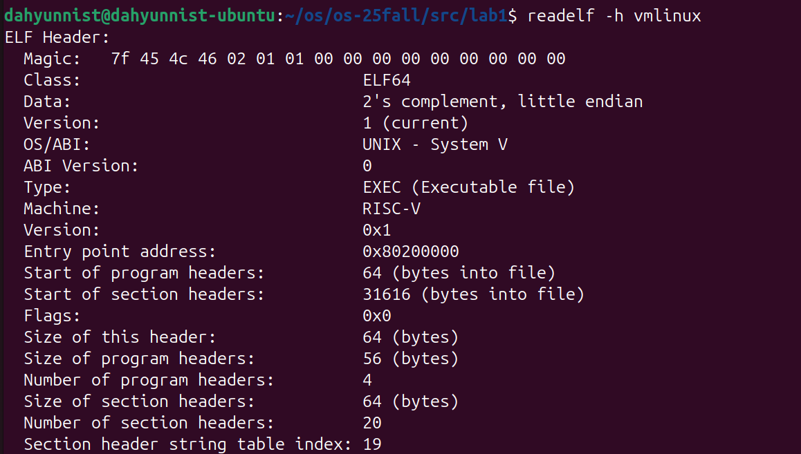
      - 查看段信息：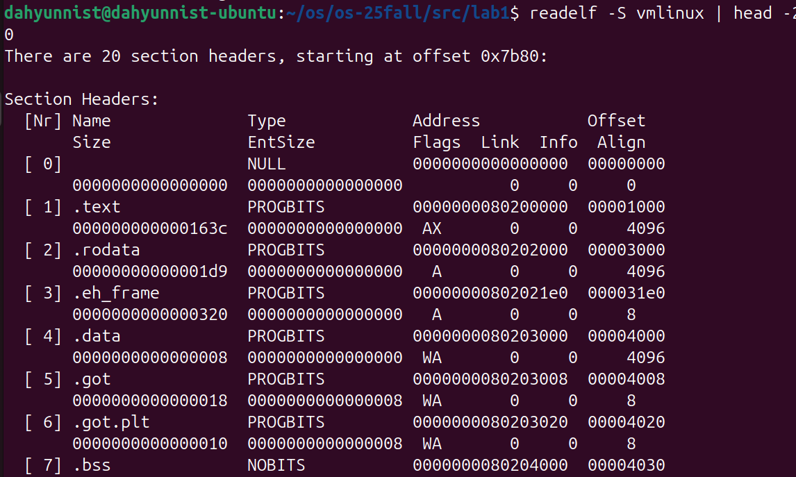
      <!-- - 查看程序头：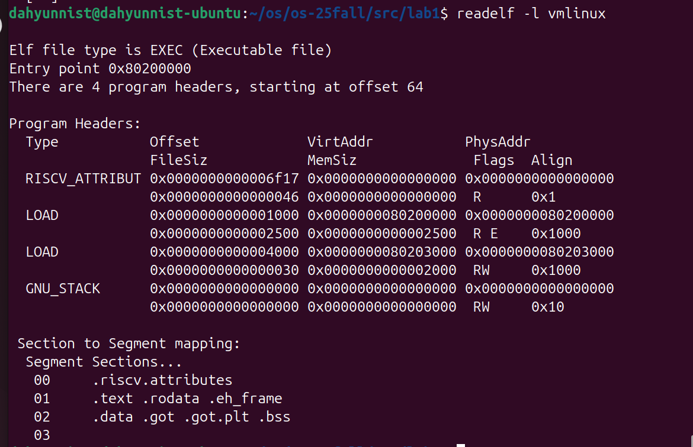 -->
    - **使用objdump查看ELF文件**:
      - 反汇编代码段：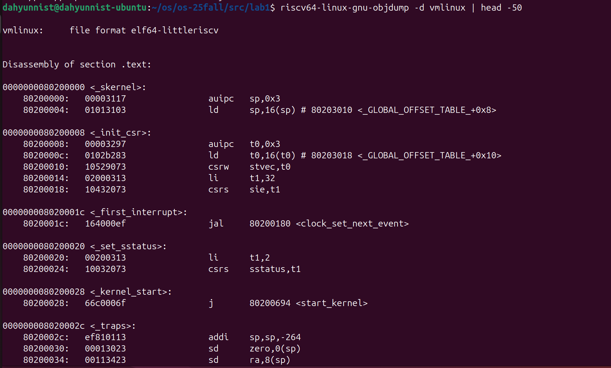
      - 查看符号表：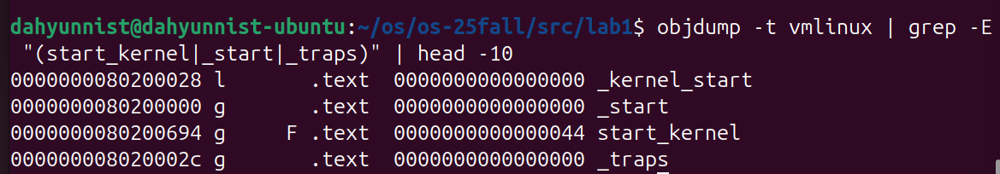
    - 运行一个 ELF 文件，然后通过 `cat /proc/PID/maps` 来给出其内存布局并截图。
      - 设计了一个`test_memory.c`文件，内容如下：
        ```c
        // test_memory.c
        #include <stdio.h>
        #include <unistd.h>

        int global_var = 100;
        int uninit_var;

        int main() {
            int local_var = 200;
            int *heap_var = malloc(1000);
            
            printf("PID: %d\n", getpid());
            printf("全局变量: %p\n", &global_var);
            printf("局部变量: %p\n", &local_var);
            printf("堆变量: %p\n", heap_var);
            printf("函数地址: %p\n", main);
            
            free(heap_var);
            return 0;
        }
        ``` 
        编译后查看内存布局：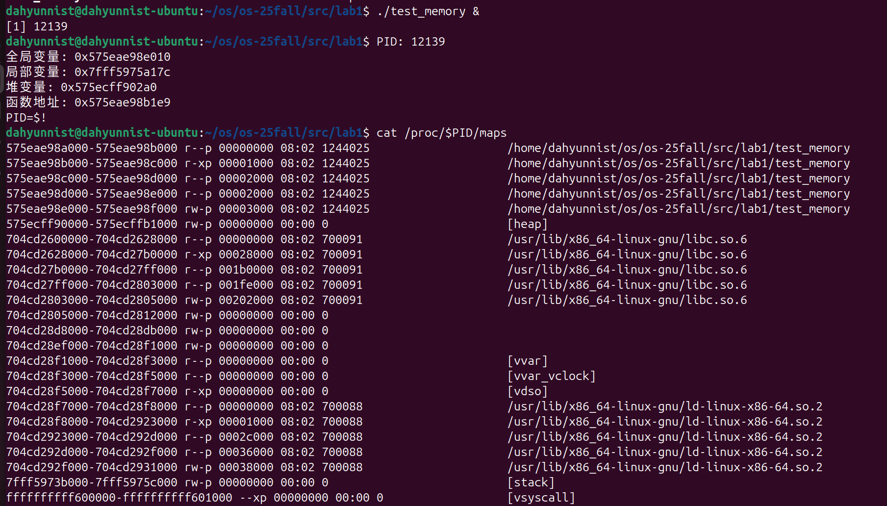
8. 在我们使用 make run 时，OpenSBI 会产生如下输出：
    ```plaintext
        OpenSBI v1.5.1
         ____                    _____ ____ _____
        / __ \                  / ____|  _ \_   _|
       | |  | |_ __   ___ _ __ | (___ | |_) || |
       | |  | | '_ \ / _ \ '_ \ \___ \|  _ < | |
       | |__| | |_) |  __/ | | |____) | |_) || |_
        \____/| .__/ \___|_| |_|_____/|____/_____|
              | |
              |_|

        ......

        Boot HART MIDELEG         : 0x0000000000000222
        Boot HART MEDELEG         : 0x000000000000b109

        ......
    ```
    - 通过查看 [RISC-V Privileged Spec](https://github.com/riscv/riscv-isa-manual/releases/download/20240411/priv-isa-asciidoc.pdf) 中的 `medeleg` 和 `mideleg` 部分，解释上面 `MIDELEG` 和 `MEDELEG` 值的含义。
      - `medeleg: 0x0000000000000222`：其`SSIP`, `STIP`, `SEIP`位均为1，说明将软件中断，时钟中断和外部中断从M模式委托给S模式处理
      - `mideleg: 0x000000000000b109`：将指令地址错误（第0位），断点异常（第3位），来自U mode环境调用（第8位），指令页错误（第12位），取指页错误（第13位）和AMO页错误（第15位）从M模式委托给S模式处理

#### 心得体会
通过本次实验，我加深了对内核架构和时钟中断机制的理解，对内核编写、编译、链接、运行、调试的全过程有了更切身的实践体会，同时也通过编写汇编文件和内联汇编复习了很多汇编知识，虽然做得很慢（因为真的忘记了很多学过的东西）但是获益匪浅。

