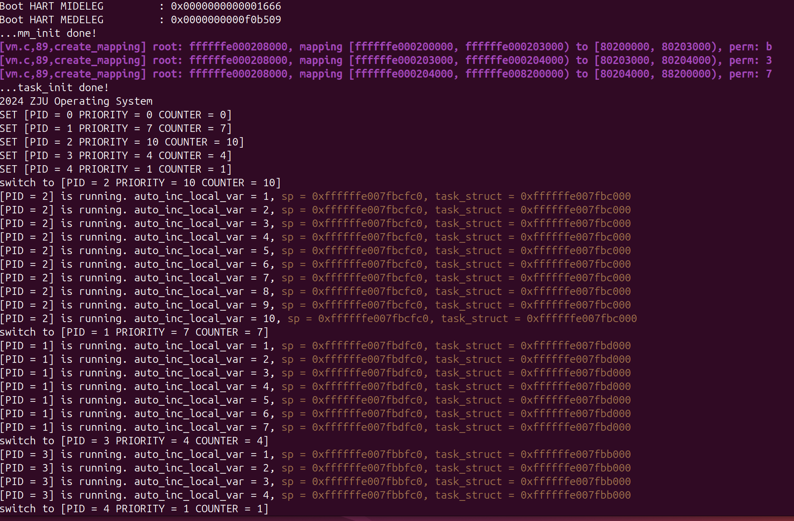
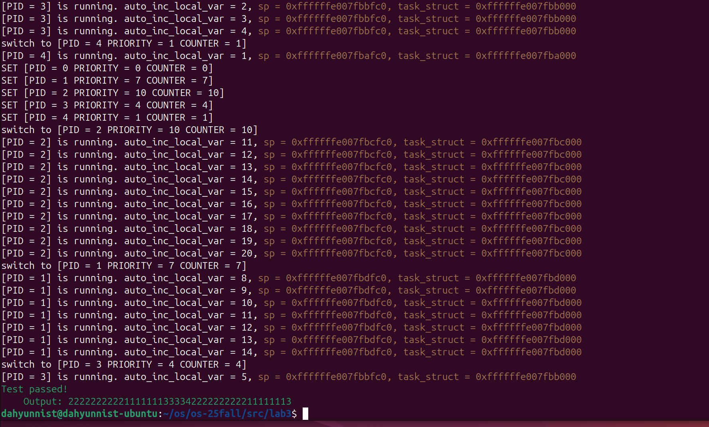
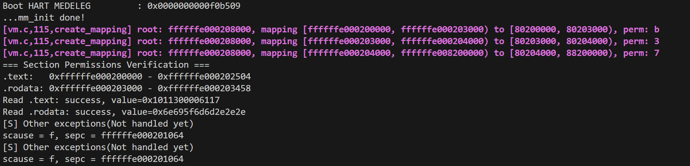

# Lab 3: RV64 虚拟内存管理

## 实验具体过程与代码实现
### 准备工程
1. 修改`defs.h`，在其中添加如下内容：
   ```c
    #define OPENSBI_SIZE (0x200000)

    #define VM_START (0xffffffe000000000)
    #define VM_END (0xffffffff00000000)
    #define VM_SIZE (VM_END - VM_START)

    #define PA2VA_OFFSET (VM_START - PHY_START)
   ```
   同时添加如下内容，便于地址、页号等的互相转换，以及常量位的表示与使用：
   ```c
    // 取虚拟页号VPN[0-2]
    #define VPN0(va) (((uint64_t)(va) >> 12) & 0x1ff)
    #define VPN1(va) (((uint64_t)(va) >> 21) & 0x1ff)
    #define VPN2(va) (((uint64_t)(va) >> 30) & 0x1ff)
    // PTE转换为物理地址
    #define PHY(pte) (((uint64_t)(pte) >> 10) << 12)
    // 物理地址转换为PPN，而后可与权限位组合成PTE
    #define PPN(phy) (((uint64_t)(phy) >> 12) << 10)
    // PTE权限位
    #define PTE_V (1L << 0)
    #define PTE_R (1L << 1)
    #define PTE_W (1L << 2)
    #define PTE_X (1L << 3)
   ```
2. 从课程仓库同步`vmlinux.lds`代码（略）
   - 新的`vmlinux.lds`编译后得到的`System.map`以及`vmlinux`中的符号采用的都是虚拟地址
3. 关闭PIE
   - 在启用虚拟地址之前，从GOT表中取到的虚拟地址都是不可用的，需要手动减去`PA2VA_OFFSET`才能得到正确的物理地址。因此，在本实验中，需要通过给Makefile的`CF`中加一个`-fno-pie` 就可以强制不编译出 PIE 的代码。
### 开启虚拟内存映射
1. 在 RISC-V 中开启虚拟地址被分为了两步：`setup_vm` 以及`setup_vm_final`，前者负责设置初始1GB大页表的映射，并伴随设置`satp`以开始使用虚拟地址，后者负责为进程建立三级页表
#### `setup_vm` 的实现
1. 使用1GB大页表`early_pgtbl`，将0x80000000 开始的 1GB 区域进行两次映射，其中一次是等值映射（PA == VA），另一次是将其映射到 `direct mapping area`（使得 `PA + PV2VA_OFFSET == VA`），具体实现如下：
   ```c
    /* early_pgtbl: 用于 setup_vm 进行 1GiB 的映射 */
    uint64_t early_pgtbl[512] __attribute__((__aligned__(0x1000)));

    void setup_vm() {
        /* 
        * 1. 由于是进行 1GiB 的映射，这里不需要使用多级页表 
        * 2. 将 va 的 64bit 作为如下划分： | high bit | 9 bit | 30 bit |
        *     high bit 可以忽略
        *     中间 9 bit 作为 early_pgtbl 的 index
        *     低 30 bit 作为页内偏移，这里注意到 30 = 9 + 9 + 12，即我们只使用根页表，根页表的每个 entry 都对应 1GiB 的区域
        * 3. Page Table Entry 的权限 V | R | W | X 位设置为 1
        **/
        memset(early_pgtbl, 0x0, PGSIZE);
        uint64_t pte = ((PHY_START >> 30) << 28) | 0xF;  //设置的页表项，由于是1GB大页表，低30位都属于页内偏移，所以要右移30位；同理，只需设置PPN[2]，即左移28位；并且设置低4位的权限
        int physical_index = (PHY_START >> 30) & 0x1FF; 
        int virtual_index = (VM_START >> 30) & 0x1FF; 
        early_pgtbl[physical_index] = pte; //等值映射
        early_pgtbl[virtual_index] = pte; //映射到direct mapping area
    }
   ```
2. 完成上述映射之后，通过 `relocate` 函数，完成对 `satp` 的设置，以及跳转到对应的虚拟地址。在`head.S`中实现如下：
   ```asm
    #include "defs.h"
        ...
    _start:
        ...
        call setup_vm
        call relocate
        ...

    relocate:
        # set ra = ra + PA2VA_OFFSET
        # set sp = sp + PA2VA_OFFSET (If you have set the sp before)

        ###################### 
        li t0, PA2VA_OFFSET
        add ra, ra, t0
        add sp, sp, t0
        ######################

        # set satp with early_pgtbl

        ######################
        # 设置MODE段
        li t1, 8
        slli t1, t1, 60
        # 设置PPN段
        la t2, early_pgtbl
        srli t2, t2, 12
        # 组装（ASID本实验中直接置0）
        or t1, t1, t2
        csrw satp, t1 
        ######################
        # 从设置完satp后到ret之前的指令，虽然是物理地址，但是会被当做虚拟地址，
        # 因为前面设置过等值映射，所以能够从early_pgtbl中取到其对应的等值物理地址，不妨碍正常执行

        # need a fence to ensure the new translations are in use
        sfence.vma zero, zero

        ret

        .section .bss.stack
        .globl boot_stack
    boot_stack:
        ...
   ```
3. 此外，还需要修改`mm_init`函数中释放内存的范围：
   ```c
    void mm_init(void) {
        // 此时已经开启了虚拟地址，需要将结束地址调整为虚拟地址，即扩大PA2VA_OFFSET
        kfreerange(_ekernel, (char *)PHY_END + PA2VA_OFFSET);
        printk("...mm_init done!\n");
    }
   ```
#### `setup_vm_final` 的实现
1. 由于 `setup_vm_final` 中需要申请页面来建立多级页表，我们需要先调用 `mm_init` 来完成内存管理初始化，同时如上一节所述，以将 `mm_init` 中 `kfreerange` 的结束地址调整为虚拟地址。在`head.S`中的调用顺序如下：
   ```asm
   call setup_vm
   call relocate
   call mm_init
   call setup_vm_final
   call task_init
   ```
2. `setup_vm_final` 需要完成对所有物理内存 (128M) 的映射，并设置正确的权限。实现如下：
   ```c
    /* swapper_pg_dir: kernel pagetable 根目录，在 setup_vm_final 进行映射 */
    uint64_t swapper_pg_dir[512] __attribute__((__aligned__(0x1000)));

    extern char _stext[], _etext[];
    extern char _srodata[], _erodata[];
    extern char _sdata[], _edata[];
    extern char _sbss[], _ebss[];

    void create_mapping(uint64_t *pgtbl, uint64_t va, uint64_t pa, uint64_t sz, uint64_t perm);

    void setup_vm_final() {
        memset(swapper_pg_dir, 0x0, PGSIZE);

        // No OpenSBI mapping required
        uint64_t pa = PHY_START + OPENSBI_SIZE;

        // mapping kernel text X|-|R|V
        create_mapping(swapper_pg_dir, (uint64_t)_stext, pa, _srodata - _stext, PTE_X | PTE_R | PTE_V);

        // mapping kernel rodata -|-|R|V
        pa += _srodata - _stext;
        create_mapping(swapper_pg_dir, (uint64_t)_srodata, pa, _sdata - _srodata, PTE_R | PTE_V);

        // mapping other memory -|W|R|V
        pa += _sdata - _srodata;
        create_mapping(swapper_pg_dir, (uint64_t)_sdata, pa, PHY_SIZE - (_sdata - _stext), PTE_W | PTE_R | PTE_V);

        // set satp with swapper_pg_dir
        // 借用了head.S中设置satp的代码，但其实用csr_write函数更简单些
        // 内联汇编无法识别c文件的宏，所以使用mv而不是li来载入PA2VA_OFFSET
        asm volatile(
            "li t1, 8\n"
            "slli t1, t1, 60\n"
            "la t2, swapper_pg_dir\n"
            "mv t3, %[arg0]\n"
            "sub t2, t2, t3\n"
            "srli t2, t2, 12\n"
            "or t1, t1, t2\n"
            "csrw satp, t1\n"
            :
            : [arg0] "r" (PA2VA_OFFSET)
            : "t1", "t2", "t3", "memory"
        );
        // flush TLB
        asm volatile("sfence.vma zero, zero");
        return;
    }
   ```
3. `create_mapping`负责创建多级页表映射关系，实现如下：
   ```c
    void create_mapping(uint64_t *pgtbl, uint64_t va, uint64_t pa, uint64_t sz, uint64_t perm) {
        /*
        * pgtbl 为根页表的基地址
        * va, pa 为需要映射的虚拟地址、物理地址
        * sz 为映射的大小，单位为字节
        * perm 为映射的权限（即页表项的低 8 位）
        * 
        * 创建多级页表的时候可以使用 kalloc() 来获取一页作为页表目录
        * 可以使用 V bit 来判断页表项是否存在
        **/
        Log("root: %lx, mapping [%lx, %lx) to [%lx, %lx), perm: %x", pgtbl, va, va+sz, pa, pa+sz, perm);
        uint64_t va_end = va + sz;
        uint64_t *cur_tbl, cur_vpn0, cur_vpn1, cur_vpn2, cur_pte;
        // 从va开始一页一页分配，直到到达va末为止
        for(uint64_t cur_va = va, cur_pa = pa; cur_va < va_end; cur_va += PGSIZE, cur_pa += PGSIZE){
            // 取到所需的虚拟页号
            cur_vpn0 = VPN0(cur_va);
            cur_vpn1 = VPN1(cur_va);
            cur_vpn2 = VPN2(cur_va);
            // 先从根页表查，看vpn[2]对应的页是否有效，无效则分配新页作为二级页表
            cur_tbl = pgtbl;
            cur_pte = *(cur_tbl + cur_vpn2);
            if(!(cur_pte & PTE_V)){
                uint64_t new_page_phy = (uint64_t)kalloc() - PA2VA_OFFSET;
                cur_pte = PPN(new_page_phy) | PTE_V;
                *(cur_tbl + cur_vpn2) = cur_pte;
            }
            // 第二级，查看vpn[1]对应的页是否有效，无效则分配一个新页作为三级页表
            cur_tbl = (uint64_t*)(PHY(cur_pte) + PA2VA_OFFSET);
            cur_pte = *(cur_tbl + cur_vpn1);
            if(!(cur_pte & PTE_V)){
                uint64_t new_page_phy = (uint64_t)kalloc() - PA2VA_OFFSET;
                cur_pte = PPN(new_page_phy) | PTE_V;
                *(cur_tbl + cur_vpn1) = cur_pte;
            }
            // 第三级页表指向具体的数据页，把pa转换成pte放进vpn[0]即可
            cur_tbl = (uint64_t*)(PHY(cur_pte) + PA2VA_OFFSET);
            cur_pte = PPN(cur_pa) | PTE_V | perm;
            *(cur_tbl + cur_vpn0) = cur_pte;
        }
    }
   ```
#### 编译及测试


## 实验结果与分析
1. 如图，可以正常运行并通过测试：  


## 实验中遇到的问题及解决方法
实验中一度遇到无法启用临时页表，导致程序读取指令内存错误的问题，经过排查发现是satp设置有误，很快得以纠正

## 思考题与心得体会
### 思考题
1. 验证 `.text`，`.rodata` 段的属性是否成功设置，给出截图。
   - 程序可以运行说明`.text`的可执行权限设置正确
   - 接下来测试两段的读写属性设置。使用如下测试代码：
    ```c
    // 在设置页表后验证权限
    void verify_section_permissions() {
        extern char _stext[], _etext[], _srodata[], _erodata[];
        printk("=== Section Permissions Verification ===\n");
        printk(".text:   0x%lx - 0x%lx\n", (uint64_t)_stext, (uint64_t)_etext);
        printk(".rodata: 0x%lx - 0x%lx\n", (uint64_t)_srodata, (uint64_t)_erodata);
        // 尝试读取 - 应该成功
        uint64_t text_value = *(uint64_t*)_stext;
        printk("Read .text: success, value=0x%lx\n", text_value);
        // 尝试读取.rodata - 应该成功
        uint64_t rodata_value = *(uint64_t*)_srodata;
        printk("Read .rodata: success, value=0x%lx\n", rodata_value);
        
        // 尝试写入.rodata - 应该触发页错误
        *(uint64_t*)_srodata = 0x12345678;
    }
    ```
   - 在`setup_vm_final`函数的最后调用该函数，运行结果如图：  <br/>可以看到`.text`和`.rodata`均可读，但在尝试写入`.rodata`时触发了异常，`scause`值为`f`（Store/AMO page fault）符合预期
2. 为什么我们在 `setup_vm` 中需要做等值映射？在 Linux 中，是不需要做等值映射的，请探索一下不在 `setup_vm` 中做等值映射的方法。你需要回答以下问题：
    - 本次实验中如果不做等值映射，会出现什么问题，原因是什么；
      - 会出现启动虚拟内存后立即崩溃的问题。因为设置satp后MMU已经启用，但下一条指令pc还是物理地址，不做等值映射的话就无法通过正确翻译
    - 简要分析 [Linux v5.2.21](https://elixir.bootlin.com/linux/v5.2.21/source) 或之后的版本中的内核启动部分（直至 `init/main.c` 中 `start_kernel` 开始之前），特别是设置 satp 切换页表附近的逻辑；
      - `head.S`中首先调用`setup_vm`函数，创建了临时页表`trampoline_pg_dir`(直接映射)和最终内核页表`swapper_pg_dir`:
        ```c
        va_pa_offset = PAGE_OFFSET - pa;  // 计算虚拟-物理偏移
        pfn_base = PFN_DOWN(pa);          // 计算基础页帧号
        // 设置trampoline页表
        trampoline_pg_dir[(PAGE_OFFSET >> PGDIR_SHIFT) % PTRS_PER_PGD] =
            pfn_pgd(PFN_DOWN(pa), prot);  // 建立直接映射
        // 设置swapper页表（最终内核页表）
        for (i = 0; i < (-PAGE_OFFSET)/PGDIR_SIZE; ++i) {
            size_t o = (PAGE_OFFSET >> PGDIR_SHIFT) % PTRS_PER_PGD + i;
            swapper_pg_dir[o] =
                pfn_pgd(PFN_DOWN(pa + i * PGDIR_SIZE), prot);  // 建立内核映射
        }
        ``` 
       - 随后，使用`relocate`函数，分两阶段先后使用`trampoline_pg_dir`和`swapper_pg_dir`
    - 回答 Linux 为什么可以不进行等值映射，它是如何在无等值映射的情况下让 pc 从物理地址跳到虚拟地址；
      - Linux同样使用临时页表和最终页表，但是两者都使用了PA → VA直接映射
    - Linux v5.2.21 中的 `trampoline_pg_dir` 和 `swapper_pg_dir` 有什么区别，它们分别是在哪里通过 satp 设为所使用的页表的；
      - `trampoline_pg_dir`是单一的 PA → VA 直接映射，只映射内核起始区域的一个大页，在`relocate`中第一次设置satp时使用；`swapper_pg_dir`则是完整的 PA → VA 内核空间映射，映射整个内核地址空间，在`relocate` 中第二次设置satp时使用
    - 尝试修改你的 kernel，使得其可以像 Linux 一样不需要等值映射。


### 心得体会
本次实验主要实现了虚拟内存管理，在实践和试错中加深了我对相关原理的理解，也掌握了更多linux启动和运行流程的知识，受益匪浅。


