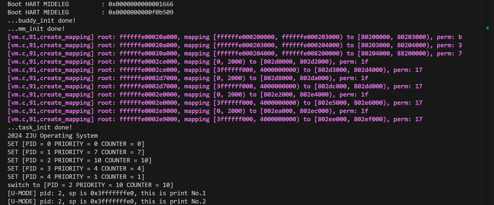
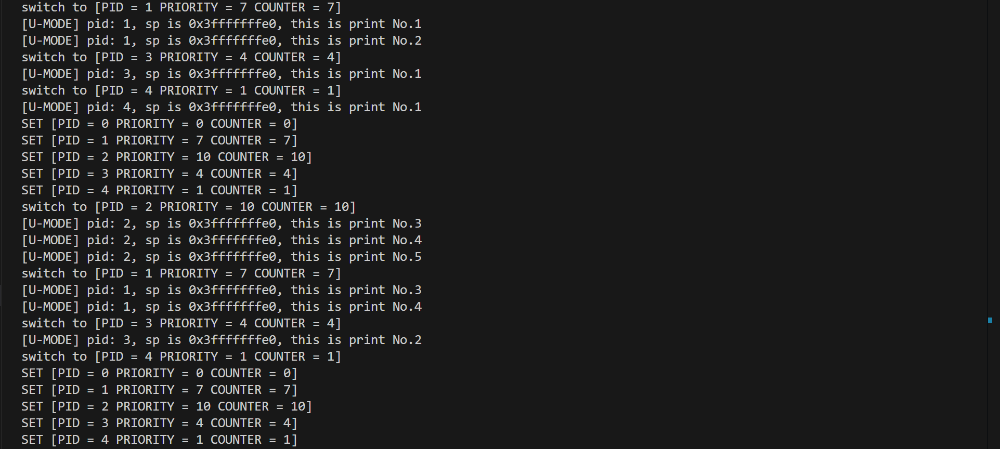
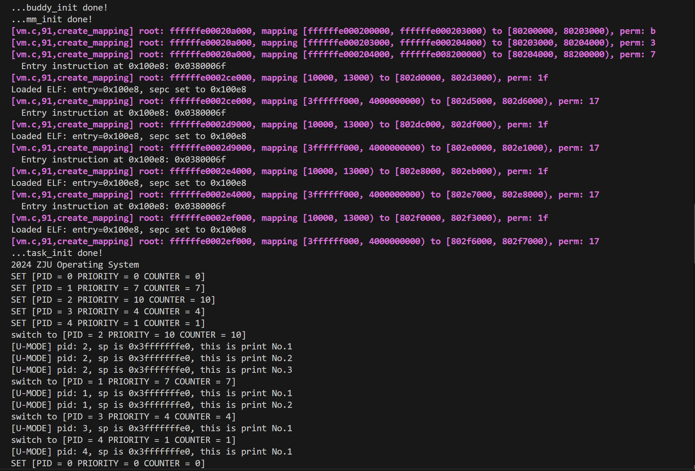

# Lab 4: RV64 用户态程序

## 实验具体过程与代码实现
### 准备工程
1. 修改 `vmlinux.lds`，将用户态程序 `uapp` 加载至 `.data` 段：
    ```
        .data : ALIGN(0x1000) {
            _sdata = .;
    
            *(.sdata .sdata*)
            *(.data .data.*)
            
            _edata = .;
    
            . = ALIGN(0x1000);
            _sramdisk = .;
            *(.uapp .uapp*)
            _eramdisk = .;
            . = ALIGN(0x1000);
        } >ramv AT>ram
    ```
    `_sramdisk`和`_eramdisk`即标志着`uapp`部分的开始和结束位置，而在纯二进制文件中，`_sramdisk` 处的指令就是要执行的第一条指令。
2. 修改 `defs.h`，在 `defs.h`中添加如下内容：
    ```c
    #define USER_START (0x0000000000000000) // user space start virtual address
    #define USER_END (0x0000004000000000) // user space end virtual address
    ```
3. 从远程同步相关文件（略）
4. 修改根目录下的Makefile, 将 `user` 文件夹下的内容纳入工程管理:
   ```Makefile
    ...

    all: clean
        $(MAKE) -C lib all
        $(MAKE) -C init all
        $(MAKE) -C user all # 添加此行
        $(MAKE) -C arch/riscv all
        @echo -e '\n'Build Finished OK

    ...

    clean:
        $(MAKE) -C lib clean
        $(MAKE) -C init clean
        $(MAKE) -C user clean # 添加此行
        $(MAKE) -C arch/riscv clean

    ...
   ```
### 创建用户态进程
#### 结构体更新
1. 本次实验只需要创建4个用户态进程，因此修改`proc.h` 中的 `NR_TASKS`：
   ```c
    #define NR_TASKS (1 + 4)
   ``` 
2. 对原有的线程相关数据结构进行修改：
   - `thread_struct`中加入`sepc`, `sstatus`, `sscratch`供用户态进程使用；
   - 同时为每个用户态创建一个页表并记录在`task_struct`中，以保证多个用户态进程相对隔离；
   - 由于切换进程时需要重新设置`satp`，在设置好页表后顺带计算好对应的`satp`值，存储在`task_struct`中以便切换时直接写入：
   ```c
   /* 线程状态段数据结构 */
    struct thread_struct {
        uint64_t ra;
        uint64_t sp;
        uint64_t s[12];
        uint64_t sepc, sstatus, sscratch;
    };

    /* 线程数据结构 */
    struct task_struct {
        uint64_t state;     // 线程状态
        uint64_t counter;   // 运行剩余时间
        uint64_t priority;  // 运行优先级 1 最低 10 最高
        uint64_t pid;       // 线程 id

        struct thread_struct thread;
        uint64_t *pgd; // 用户态页表
        uint64_t satp; // 根据线程页表计算出的satp值
        uint64_t user_stack;
    };
   ```
3. 修改 `task_init()`
   - 对于每个进程，初始化`thread_struct` 中新添加的三个变量：
     - 将 `sepc` 设置为 `USER_START`（完成中断处理线程第一次切换后直接 sret 到`uapp`的第一条指令处）
     - `sstatus` 中的 `SPP`设为0（使得 sret 返回至 U-Mode）、`SUM`设为1（S-Mode 可以访问 User 页面）、`SPIE` 设为 1（sret 后开启中断）
     - 将 `sscratch` 设置为 U-Mode 的 sp，其值为 `USER_END`
   - 对于每个进程，创建其独属的页表，即申请分配空间后将内核页表`swapper_pg_dir`复制过去
   - 分配一块新的内存地址，将 `uapp` 二进制文件内容拷贝过去，之后再将其所在的页面映射到对应进程的页表中
   - 设置用户态栈(内核态栈已在`thread.sp`设置好)，申请一个空的页面，将其映射到user space 的最后一个页面
   - 计算好对应的`satp`值
   ```c
    /* --- 初始化thread_struct中的三个CSR变量值 --- */
    temp->thread.sepc = USER_START;
    temp->thread.sstatus = csr_read(sstatus);
    temp->thread.sstatus &= ~(1 << 8); // SPP = 0
    temp->thread.sstatus |= (1 << 5); // SPIE = 1
    temp->thread.sstatus |= (1 << 18); // SUM = 1
    temp->thread.sscratch = USER_END;

    /* --- 对于每个进程，创建属于它自己的页表 --- */
    // 将swapper_pg_dir复制到每个进程的页表中
    temp->pgd = (uint64_t *)kalloc();
    memcpy(temp->pgd, swapper_pg_dir, PGSIZE);
    
    // 拷贝具体方法：先计算所需的页数（uapp的大小除以PGSIZE后向上取整），调用alloc_pages()函数，再将uapp memcpy过去
    uint64_t uapp_size = (uint64_t)_eramdisk - (uint64_t)_sramdisk;
    uint64_t page_num = (uapp_size + PGSIZE - 1) / PGSIZE;
    uint64_t *uapp_copy = (uint64_t *)alloc_pages(page_num);
    memcpy(uapp_copy, _sramdisk, uapp_size);

    // 将拷贝好的uapp所在页映射到表中
    create_mapping(temp->pgd, USER_START, (uint64_t)uapp_copy - PA2VA_OFFSET, page_num * PGSIZE, PTE_U | PTE_X | PTE_W | PTE_R | PTE_V);

    /* --- 设置用户态栈 --- */
    // 申请一个空的页面来作为用户态栈，并映射到进程的页表中
    temp->user_stack = kalloc();
    create_mapping(temp->pgd, USER_END - PGSIZE, temp->user_stack - PA2VA_OFFSET, PGSIZE, PTE_U | PTE_W | PTE_R | PTE_V);

    // 提前计算存储对应的satp，免去切换线程时计算的麻烦
    temp->satp = (csr_read(satp) >> 44) << 44;
    temp->satp |= ((uint64_t)(temp->pgd) - PA2VA_OFFSET) >> 12;
    task[i] = temp;
   ``` 
   - `memcpy`函数在`string.c`中实现：
    ```c
    // 仿照memset函数实现
    void *memcpy(void *dst, void *src, uint64_t n){
        char *d = (char *)dst;
        char *s = (char *)src;
        for(uint64_t i = 0; i < n; ++i){
            d[i] = s[i];
        }
        return dst;
    }
    ```
4. 修改 `__switch_to`：添加对sepc、sstatus、sscratch的保存和恢复，同时切换页表（即更新设置`satp`），并通过 `sfence.vma` 来刷新 TLB 和 ICache：
   ```asm
    __switch_to:
        # save state to prev process
        addi t0, a0, 32 # get base addr of prev thread struct

        ...

        csrr t1, sepc
        sd t1, 112(t0)
        csrr t1, sstatus
        sd t1, 120(t0)
        csrr t1, sscratch
        sd t1, 128(t0)
        csrr t1, satp
        sd t1, 144(t0) 

        # restore state from next process
        addi t1, a1, 32 # get base addr of next thread struct

        ...

        csrw sepc, t2
        ld t2, 120(t1)
        csrw sstatus, t2
        ld t2, 128(t1)
        csrw sscratch, t2
        ld t2, 144(t1) # 应写入satp的值已经预先计算好并存储在thread_struct中
        csrw satp, t2

        # flush TLB
        sfence.vma zero, zero

        ret
   ```
### 更新中断处理逻辑
1. 在用户态和内核态相互切换时，对应的栈也要进行切换（因为RISC-V 中只有一个栈指针寄存器 `sp`）
   - 修改 `__dummy`：通过交换`sscratch`和`sp`的值来实现栈切换：
    ```asm
    __dummy:
        # 切换到用户栈
        csrr t0, sscratch
        csrw sscratch, sp
        mv sp, t0
    ```
   - 修改 `_traps`：在首尾我们都需要做类似的操作，进入 trap 的时候需要切换到内核栈，处理完成后需要再切换回来。同时需注意如果是内核线程（没有用户栈）触发了异常，则不需要进行切换（内核线程的 `sp` 永远指向的内核栈，且 `sscratch` 为 0），即进行一下判断和跳转：
    ```asm
    _traps:
        # 如果sscratch不为0，交换其与sp
        csrr t0, sscratch
        beq t0, x0, _save_context
        csrw sscratch, sp
        mv sp, t0
    _save_context:
        addi sp, sp, -288

        ...
        
        # 结束时同理
        csrr t0, sscratch
        beq t0, x0, _trap_return
        csrw sscratch, sp
        mv sp, t0
    _trap_return:
        sret
    ```
   - 修改 `trap_handler`：添加对Environment Call from U-mode的处理
    ```c
    void trap_handler(uint64_t scause, uint64_t sepc, struct pt_regs *regs) {
        if(scause & 0x8000000000000000){  // Interrupt
            if(scause == 0x8000000000000005){ // timer interrupt
                clock_set_next_event();
                do_timer();
            }
            else{
                printk("[S] Other interruptions(Not handled yet)\n");
                printk("scause = %lx, sepc = %llx\n", scause, sepc);
            }
        }
        else{  // Exception
            if(scause == 0x0000000000000008){
                syscall(regs);
            }
            else{
                printk("[S] Other exceptions(Not handled yet)\n");
                printk("scause = %lx, sepc = %llx\n", scause, sepc);
            }
        } 
    }
    ```
   - `trap_handler`处理系统调用时需要对进程在`_traps`中保存于栈上的常规寄存器和`sepc`值进行操作，因此将这一段栈上内容看作结构体`pt_regs`，将其地址传入`trap_handler`即可进行操作。对`pt_regs`定义如下(按照其在栈上的顺序)：
    ```c
    struct pt_regs {
        uint64_t zero;      // x0
        uint64_t ra;        // x1
        uint64_t sp;        // x2
        uint64_t gp;        // x3
        uint64_t tp;        // x4
        uint64_t t0;        // x5
        uint64_t t1;        // x6
        uint64_t t2;        // x7
        uint64_t s0;        // x8
        uint64_t s1;        // x9
        uint64_t a0;        // x10, 系统调用返回值
        uint64_t a1;        // x11
        uint64_t a2;        // x12
        uint64_t a3;        // x13
        uint64_t a4;        // x14
        uint64_t a5;        // x15
        uint64_t a6;        // x16, 系统调用号
        uint64_t a7;        // x17
        uint64_t s2;        // x18
        uint64_t s3;        // x19
        uint64_t s4;        // x20
        uint64_t s5;        // x21
        uint64_t s6;        // x22
        uint64_t s7;        // x23
        uint64_t s8;        // x24
        uint64_t s9;        // x25
        uint64_t s10;       // x26
        uint64_t s11;       // x27
        uint64_t t3;        // x28
        uint64_t t4;        // x29
        uint64_t t5;        // x30
        uint64_t t6;        // x31
        uint64_t sepc;
        uint64_t sstatus; // sstatus也保存在栈上，索性纳入结构体
    };
    ```
    同时需要保障`_traps`中保存和恢复的顺序与之一致。
### 添加系统调用
1. 实现`syscall()`函数，完成系统调用，在本实验中主要实现SYS_WRITE和SYS_GETPID
    ```c
    // 64 号系统调用 sys_write(unsigned int fd, const char* buf, size_t count) 该调用将用户态传递的字符串打印到屏幕上，此处fd为标准输出即 1，buf 为用户需要打印的起始地址，count为字符串长度，返回打印的字符数；
    // 172 号系统调用sys_getpid(), 该调用从current中获取当前的 pid 放入 a0 中返回，无参数
    void syscall(struct pt_regs *regs){
        if(regs->a7 == SYS_WRITE){
            // 3个参数：fd 为标准输出即 1，buf 为用户需要打印的起始地址，count 为字符串长度
            if(regs->a0 == 1){
                char *buf = (char *)regs->a1;
                for(int i = 0; i < regs->a2; i++){
                    printk("%c", buf[i]);
                }
                // 返回打印的字符数
                regs->a0 = regs->a2;
            }
            else{
                printk("SYS_WRITE with fd = %d not supported yet\n", regs->a0);
            }
        }
        else if(regs->a7 == SYS_GETPID){
            regs->a0 = current->pid;
        }
        else{
            printk("syscall %d not supported yet", regs->a7);
        }
        // 需要手动给sepc加4，不然返回后还是执行同一条ecall，循环不停
        regs->sepc += 4;
    }
    ```
### 调整时钟中断
1. 更改为 OS boot 完成之后立即调度 uapp 运行，即在 `start_kernel()` 中，`test()` 之前调用 `schedule()`：
   ```c
    extern void test();
    extern void schedule();

    int start_kernel() {
        printk("2024");
        printk(" ZJU Operating System\n");

        schedule();

        test();
        
        return 0;
    }
   ```
2. 将 `head.S` 中设置 sstatus.SIE 的逻辑注释掉，确保 schedule 过程不受中断影响

### 测试纯二进制文件

### 添加 ELF 解析与加载
1. 将 `uapp.S` 中的 payload 换成ELF 文件：
    ```asm title="user/uapp.S" linenums="1"
    .section .uapp

    .incbin "uapp"
    ```
2. 修改`task_init`，将其中设置`sepc`和拷贝映射`uapp`的部分替换为调用`load_program`函数：
   - 引入`Elf64_Ehdr`和`Elf64_Phdr`结构体，来解析ELF Header信息
   - 在拷贝每一个segment时需要特别注意的是，虚拟内存和物理内存的映射是按页为单位的，如果`e_entry` 并没有按页对齐，在拷贝时也要保留这一性质，即将其拷贝到从**分配页起始地址+偏移offset**开始的空间
   ```c
    void load_program(struct task_struct *task) {
        Elf64_Ehdr *ehdr = (Elf64_Ehdr *)_sramdisk;
        Elf64_Phdr *phdrs = (Elf64_Phdr *)(_sramdisk + ehdr->e_phoff);
        for (int i = 0; i < ehdr->e_phnum; ++i) {
            Elf64_Phdr *phdr = phdrs + i;
            if (phdr->p_type == PT_LOAD) {
                // alloc space and copy content
                uint64_t va_start = PGROUNDDOWN(phdr->p_vaddr);
                uint64_t offset = phdr->p_vaddr - va_start;

                uint64_t page_num = (phdr->p_memsz + PGSIZE - 1) / PGSIZE;
                char *mem_copy = alloc_pages(page_num);
                memcpy(mem_copy + offset, (char *)ehdr + phdr->p_offset, phdr->p_filesz);
                if(phdr->p_memsz > phdr->p_filesz){
                    memset(mem_copy + offset + phdr->p_filesz, 0, phdr->p_memsz - phdr->p_filesz);
                }
                // do mapping
                uint64_t pa_start = (uint64_t)mem_copy - PA2VA_OFFSET;
                uint64_t size = PGROUNDUP(va_start + phdr->p_memsz) - va_start;
                uint64_t perm = PTE_V | PTE_U;
                if(phdr->p_flags & PF_R){
                    perm |= PTE_R;
                }
                if(phdr->p_flags & PF_W){
                    perm |= PTE_W;
                }
                if(phdr->p_flags & PF_X){
                    perm |= PTE_X;
                }
                create_mapping(task->pgd, va_start, pa_start, size, perm);
                // code...
            }
        }
        task->thread.sepc = ehdr->e_entry;
    }
   ```
## 实验结果与分析
1. 测试纯二进制文件，可以正常运行：  
2. 改为ELF格式后，仍可以正常运行：


## 实验中遇到的问题及解决方法
- 实验中主要在“添加 ELF 解析与加载”部分遇到了页错误，经排查是没有去掉`__dummy`函数里将`sepc`设为`USER_START`的逻辑（为测试纯二进制文件而设计），导致处理完中断后`pc`没有跳转到`ehdr->e_entry`。
- 研究后发现在本实验中，`sepc`已作为线程`thread_struct`的成员变量被设置，在跳转`__dummy`函数之前的`__switch_to`函数中也有`sepc`的保存恢复。因此不同于此前实验里需要设置`sepc = dummy`使线程跳回`dummy()`，`__dummy`函数里不再需要对`sepc`进行操作。
- 此外遇到的问题大多源于编程时的粗心错误，经排查后很快得到纠正。

## 思考题与心得体会
### 思考题
1. 我们在实验中使用的用户态线程和内核态线程的对应关系是怎样的？（一对一，一对多，多对一还是多对多）
   - 一对一。每个用户态线程对应一个内核线程（`task_struct`），拥有独立的页表和上下文（即`pgd`和`thread_struct`）。内核通过`schedule()`函数管理和调度这些线程。
2. 系统调用返回为什么不能直接修改寄存器？
   - `_traps`函数会执行在调用`trap_handler`（包含了处理系统调用）的前后保存和恢复上下文。如果在系统调用中直接修改寄存器，那么在处理完成返回`_traps`后，相关寄存器值会被上下文恢复操作覆盖。
3. 针对系统调用，为什么要手动将 sepc + 4？
   - 因为系统调用是由`ecall`引起，处理完成后需要执行`ecall`后面的指令。如果没有`sepc + 4`，系统调用完成后仍会返回到`ecall`的位置，导致同一条`ecall`无限循环执行。
4. 为什么 Phdr 中，`p_filesz` 和 `p_memsz` 是不一样大的，它们分别表示什么？
   - `p_filesz`表示段在在 ELF 文件中的实际大小；`p_memsz`表示段加载到内存后的总大小，包含 .bss 等未初始化数据，因此大于等于`p_filesz`的大小
5. 为什么多个进程的栈虚拟地址可以是相同的？用户有没有常规的方法知道自己栈所在的物理地址？
   - 虚拟地址互相隔离，每个进程有独立的页表，相同虚拟地址通过页表映射到不同物理页；
   - 用户态无常规方法访问页表或查询物理地址。非常规情况下，`sstatus.SUM=1` 且内核显式允许时可以支持这些操作，但是有可能破坏内存隔离。

### 心得体会
通过本实验中的实践，我对于用户态和内核态的运行与切换机制有了更深入的了解，同时也巩固了虚拟内存与页表映射的相关知识，受益匪浅。

