# Lab 5: RV64 缺页异常处理与 fork 机制

## 实验具体过程与代码实现
### 缺页异常处理
#### 实现虚拟内存管理功能
1. 在`proc.h`中添加 vma 的数据结构：
2. 实现`find_vma`函数：
   - 函数逻辑较为简单：根据传入的地址 `addr`，遍历链表 `mm` 包含的 VMA 链表，找到该地址所在的 `vm_area_struct`；如果链表中所有的 `vm_area_struct` 都不包含该地址，则返回 `NULL`
   - 代码实现如下：
      ```c
      struct vm_area_struct *find_vma(struct mm_struct *mm, uint64_t addr){
         if(mm == NULL){
            return NULL;
         }
         struct vm_area_struct *cur = mm->mmap;
         if(cur == NULL){
            return NULL;
         }
         while(cur != NULL){
            if(addr >= cur->vm_start && addr < cur->vm_end){
                  return cur;
            }
            cur = cur->vm_next;
         }
         return NULL;
      }
      ```
3. 实现`do_mmap`函数：
   - 新建 `vm_area_struct` 结构体，根据传入的参数对结构体赋值,然后找到遍历`mm`链表，找到合适的位置插入进去，最后返回`vm_start`即可
   - 代码实现如下：
      ```c
      uint64_t do_mmap(struct mm_struct *mm, uint64_t addr, uint64_t len, uint64_t vm_pgoff, uint64_t vm_filesz, uint64_t flags){
         // 新建vm_area_struct结构体
         struct vm_area_struct *vma = (struct vm_area_struct *)kalloc();
         vma->vm_next = NULL;
         vma->vm_prev = NULL;

         // 计算起讫地址(此处只需如实记录即可，对齐是在分配物理页时要做的工作)
         uint64_t vm_start = addr;
         uint64_t vm_end = addr + len;

         // 检查地址有效性
         if(vm_start < USER_START || vm_end > USER_END || vm_end <= vm_start){
            return 0;
         }
         // 将传入的参数填入vma
         vma->vm_mm = mm;
         vma->vm_start = vm_start;
         vma->vm_end = vm_end;
         vma->vm_flags = flags;
         vma->vm_pgoff = vm_pgoff;
         vma->vm_filesz = vm_filesz;

         // 插入mmap，需要检查地址是否重叠并找到合适的插入位置
         // 如果此时链表尚为空，vma就是头节点
         if(mm->mmap == NULL){
            mm->mmap = vma;
            return vma->vm_start; // 注意此处要直接return，不然会和后面检查是否要插入到头节点前面的逻辑冲突，导致同一节点插入两次形成循环列表
         }

         // 遍历链表
         struct vm_area_struct *curr = mm->mmap;
         struct vm_area_struct *prev = NULL;
         while(curr != NULL){
            if(vm_start < curr->vm_end && vm_end > curr->vm_start){
                  Err("[Overlap] [%lx, %lx) overlapped with [%lx, %lx)\n", vm_start, vm_end, curr->vm_start, curr->vm_end);
                  kfree(vma);
                  return 0;
            }
            if(vm_end <= curr->vm_start){
                  break;
            }
            prev = curr;
            curr = curr->vm_next;
         }

         // 如果prev为空，说明curr为空直接没进入循环或者要插入到头节点前面，而前者已经在上面处理过了
         if(prev == NULL){
            vma->vm_next = mm->mmap;
            mm->mmap->vm_prev = vma;
            mm->mmap = vma;
         }
         else{
            vma->vm_prev = prev;
            vma->vm_next = prev->vm_next;
            prev->vm_next = vma;
            if(vma->vm_next != NULL){
                  vma->vm_next->vm_prev = vma;
            }
         }
         return vma->vm_start;
      }
      ```

4. 修改`task_init`:
   - 将lab4中`load_program`函数里拷贝elf文件的逻辑删除，改为只依据ELF头信息进行`mm`链表的构建
   - 同时，用户态栈在初始化时也仅创建VMA而不分配空间
   - 代码实现如下：
      ```c
      /* --- Load Segment --- */
      Elf64_Ehdr *ehdr = (Elf64_Ehdr *)_sramdisk;
      Elf64_Phdr *phdrs = (Elf64_Phdr *)(_sramdisk + ehdr->e_phoff);
      for (int i = 0; i < ehdr->e_phnum; ++i) {
         Log("do mapping for program segment %d\n", i);
         Elf64_Phdr *phdr = phdrs + i;
         printk("  Segment %d: type=%lu (PT_LOAD=%lu)\n", i, phdr->p_type, PT_LOAD);
         if (phdr->p_type == PT_LOAD) {
               uint64_t perm = 0;
               if(phdr->p_flags & PF_R){
                  perm |= VM_READ;
               }
               if(phdr->p_flags & PF_W){
                  perm |= VM_WRITE;
               }
               if(phdr->p_flags & PF_X){
                  perm |= VM_EXEC;
               }
               uint64_t ret = do_mmap(&temp->mm, phdr->p_vaddr, phdr->p_memsz, phdr->p_offset, phdr->p_filesz, perm);
               if (ret == 0) {
                  Err("load_program: do_mmap failed for segment %d", i);
               }
         }
      }
      temp->thread.sepc = ehdr->e_entry;
      printk("Loaded ELF: entry=0x%lx, sepc set to 0x%lx\n", 
      ehdr->e_entry, temp->thread.sepc);

      /* --- 设置用户态栈 --- */
      do_mmap(&temp->mm, USER_END - PGSIZE, PGSIZE, 0, 0, VM_ANON | VM_READ | VM_WRITE);
      ```
#### 实现缺页处理
1. 更新`trap_handler`处理逻辑：当`scause`为12（Instruction Page Fault），13（Load Page Fault）和15（Store/AMO Page Fault）时，调用`do_page_fault`函数处理缺页异常：
   ```c
   ...
   else if(scause == 0x000000000000000c){
         Log("[S] Instruction Page Fault scause = %lx, sepc = %llx, stval = %llx\n", scause, sepc, stval);
         do_page_fault(regs);
   }
   else if(scause == 0x000000000000000d){
         Log("[S] Load Page Fault scause = %lx, sepc = %llx, stval = %llx\n", scause, sepc, stval);
         do_page_fault(regs);
   }
   else if(scause == 0x000000000000000f){
         Log("[S] Store/AMO Page Fault scause = %lx, sepc = %llx, stval = %llx\n", scause, sepc, stval);
         do_page_fault(regs);
   }
   ...
   ```
2. 实现 page fault handler：
   - 捕获异常后，先通过调用`find_vma`找到异常地址对应的VMA，如果在VMA中没有记录，即是不合法的地址，则运行出错；存在记录则要进一步判断是否异常合规，如发生的是指令页错误但所在的VMA没有执行权限，则同样出错
   - 接下来判断产生异常的原因：
     - 如果是匿名区域，那么开辟一页内存，然后把这一页映射到产生异常的 task 的页表中
     - 如果不是，则访问的页是存在数据的（如代码），需要从相应位置读取出内容，然后映射到页表中
   - 特别需要注意的是，应进行文件数据复制的范围为地址bad_addr对齐后分配的一整页区域`[va_start, va_start + PGSIZE)`和文件数据区`[vma->vm_start, vma->vm_start + vma->vm_filesz)`的交集
   - 处理完成后，返回到产生了该缺页异常的那条指令，并继续执行程序
   - 代码实现如下：
      ```c
      void do_page_fault(struct pt_regs *regs) {
         // 捕获异常
         uint64_t sepc = regs->sepc;
         uint64_t bad_addr = regs->stval;
         Log("bad address = %llx, sepc = %llx\n", bad_addr, sepc);
         uint64_t scause = regs->scause;
         
         // 寻找当前 task 中导致产生了异常的地址对应的 VMA
         struct vm_area_struct *vma = find_vma(&current->mm, bad_addr);

         // 如果当前访问的虚拟地址在 VMA 中没有记录，即是不合法的地址，则运行出错（本实验不涉及）
         if(vma == NULL){
            Err("Illegal Address: Page fault at address %llx not in any VMA\n", bad_addr);
            return;
         }

         // 根据 vma 的 flags 权限判断当前 page fault 是否合法
         if(scause == PF_INSTRUCTION_PAGE_FAULT && !(vma->vm_flags & VM_EXEC)){
            Err("Permission Error: Instruction Page Fault at address %llx without EXEC permission\n", bad_addr);
            return;
         }
         if(scause == PF_LOAD_PAGE_FAULT && !(vma->vm_flags & VM_READ)){
            Err("Permission Error: Load Page Fault at address %llx without READ permission\n", bad_addr);
            return;
         }
         if(scause == PF_STORE_PAGE_FAULT && !(vma->vm_flags & VM_WRITE)){
            Err("Permission Error: Store Page Fault at address %llx without WRITE permission\n", bad_addr);
            return;
         }

         // 分配一个页，接下来要将这个页映射到对应的用户地址空间
         char *mem_page = alloc_page();
         memset(mem_page, 0, PGSIZE);

         // 准备好权限位
         uint64_t perm = PTE_V | PTE_U | PTE_A | PTE_D;
         if(vma->vm_flags & VM_READ){
            perm |= PTE_R;
         }
         if(vma->vm_flags & VM_WRITE){
            perm |= PTE_W;
         }
         if(vma->vm_flags & VM_EXEC){
            perm |= PTE_X;
         }

         uint64_t va_start = PGROUNDDOWN(bad_addr);
         uint64_t pa_start = (uint64_t)mem_page - PA2VA_OFFSET;
         // 通过 (vma->vm_flags & VM_ANON) 获得当前的 VMA 是否是匿名空间
         // 如果是匿名空间，则直接映射即可
         // 如果不是，则需要根据 vma->vm_pgoff 等信息从 ELF 中读取数据，填充后映射到用户空间
         if(!(vma->vm_flags & VM_ANON)){
            Elf64_Ehdr *ehdr = (Elf64_Ehdr *)_sramdisk;
            uint64_t copy_area_start = max(va_start, vma->vm_start);
            uint64_t copy_area_end = min(va_start + PGSIZE, vma->vm_start + vma->vm_filesz);
            if(copy_area_start < copy_area_end){
                  uint64_t file_offset = (copy_area_start - vma->vm_start) + vma->vm_pgoff;
                  uint64_t page_offset = copy_area_start - va_start;
                  uint64_t copy_size = copy_area_end - copy_area_start;
                  memcpy(mem_page + page_offset, (char *)ehdr + file_offset, copy_size);
            }
         }

         create_mapping(current->pgd, va_start, pa_start, PGSIZE, perm);

         // 返回到产生了该缺页异常的那条指令，并继续执行程序
         asm volatile("sfence.vma zero, zero");
      }
      ```
### Fork 系统调用
#### 准备工作
1. 新建全局变量`nr_tasks`，用它替换`task_init`函数中循环初始化进程部分和`schedule`函数中遍历调度部分里使用的`NR_TASKS`，此后`NR_TASKS`仅代表最大进程数量，在初始化时会生成`tasks[NR_TASKS]` 数组备用，而实际可以运行并参与调度的进程数量由`nr_tasks`决定
2. 添加系统调用处理：修改`syscall`函数，当调用号为220（`SYS_CLONE`）时调用`do_fork`函数：
   ```c
   ...
   else if(regs->a7 == SYS_CLONE){
         regs->a0 = do_fork(regs);
      }
   ...
   ```
3. 在`defs.h`和`user/` 下的 `syscall.h`添加`SYS_CLONE`的宏定义
#### 实现进程fork
1. fork的流程基本可分为：
   - 创建新进程
   - 拷贝内核栈，完整继承父进程基本信息，但是对个别成员变量需要单独设置：
     - `_task->pid` 根据 `nr_tasks` 赋值
     - `_task->pgd` 为新分配的页表地址
     - `_task->mm.mmap` 设为 `NULL`
     - `thread.sp`需要存放子进程的`pt_regs`地址，而子进程由于拷贝了父进程的内核栈，所以其`pt_regs`在栈内的偏移与父进程相同，据此可以计算得到
     - `thread.sscratch`存放用户栈指针（与父进程相同，而父进程的用户态指针在fork时放在`sscratch`寄存器里面），经`__switch_to`传给`sscratch`寄存器，再经`__ret_from_fork`换给sp寄存器，回到用户态执行
     - `pt_regs->sp`存放内核栈指针，经`__ret_from_fork`赋给`sp`寄存器，再交换到`sscratch`寄存器里面，而内核栈指针根据子进程分配页返回的地址计算就可得到
   - 创建子进程页表
     - 遍历父进程 vma，并遍历父进程页表
        - 将这个 vma 也添加到新进程的 vma 链表中
        - 如果该 vma 项有对应的页表项存在（说明已经创建了映射），则需要深拷贝一整页的内容并映射到新页表中
   - 处理进程返回逻辑
     - 父进程直接在`do_fork` 函数返回子进程的 pid
     - 子进程返回值为0，要存放在`pt_regs->a0`中；返回的地址放在`thread.ra`中，需要与父进程处理完fork后回到的地址（即`call trap_handler`的下一条指令）相同。为此需要在entry.S中添加一个全局标签`ret_from_fork`，并将该标签地址赋给`thread.ra`：
         ```assembly
            call trap_handler
            .globl ret_from_fork 
         ret_from_fork:
            ld t1, 256(sp)
            csrw sepc, t1
            ld t1, 264(sp)
            ...
         ```
      - 此外还要给子进程的`pt_regs->sepc`手动加4，这样和父进程处理完系统调用后返回的地址一致（父进程相应的手动加4逻辑在`syscall`函数里实现过了）
    - 代码实现如下：
      ```c
      extern void __ret_from_fork();

      uint64_t do_fork(struct pt_regs *regs){
         // 创建一个新进程
         struct task_struct *_task = (struct task_struct*)kalloc();
         
         /* --- 拷贝内核栈 --- */
         // 关于子进程的所有信息都要在深拷贝之后再进行赋值，因为深拷贝之后，拷贝来的父进程信息会把前面的操作都覆盖掉
         // 深拷贝整个页
         memcpy((void*)_task, (void*)current, PGSIZE);
         _task->kernel_stack = (uint64_t)_task + PGSIZE;
         _task->pid = nr_tasks;  
         _task->pgd = (uint64_t *)kalloc();
         _task->mm.mmap = NULL; 
         // 计算子进程的pt_regs位置（在内核栈上，和父进程一样的位置）
         uint64_t pt_regs_offset = (uint64_t)regs - (uint64_t)current;
         struct pt_regs *child_regs = (uint64_t)_task + (uint64_t)pt_regs_offset;

         /* --- 创建子进程页表 --- */
         // 拷贝内核页表 swapper_pg_dir
         memcpy(_task->pgd, swapper_pg_dir, PGSIZE);
         _task->satp = (csr_read(satp) >> 44) << 44;
         _task->satp |= ((uint64_t)(_task->pgd) - PA2VA_OFFSET) >> 12;

         // 遍历父进程 vma，并遍历父进程页表
         // 将这个 vma 也添加到新进程的 vma 链表中
         // 如果该 vma 项有对应的页表项存在（说明已经创建了映射），则需要深拷贝一整页的内容并映射到新页表中
         struct vm_area_struct *vma = current->mm.mmap;
         while(vma != NULL){
            // 把vma添加到新进程的vma链表中
            do_mmap(&_task->mm, vma->vm_start, vma->vm_end - vma->vm_start, vma->vm_pgoff, vma->vm_filesz, vma->vm_flags);
            // 从vma的开始地址开始一页一页检查，直到到达vma的结束地址为止
            uint64_t va_start = PGROUNDDOWN(vma->vm_start);
            uint64_t va_end = PGROUNDUP(vma->vm_end);
            uint64_t *cur_tbl, cur_vpn0, cur_vpn1, cur_vpn2, cur_pte;
            // 从va开始一页一页检查，直到到达va末为止
            for(uint64_t cur_va = va_start; cur_va < va_end; cur_va += PGSIZE){
                  cur_vpn0 = VPN0(cur_va);
                  cur_vpn1 = VPN1(cur_va);
                  cur_vpn2 = VPN2(cur_va);
                  // 先从父进程的根页表查，看vpn[2]对应的页是否有效，无效则遍历下一页
                  cur_tbl = current->pgd;
                  if(cur_tbl == NULL){
                     continue;  // 安全检查：如果页表为空，跳过
                  }
                  cur_pte = *(cur_tbl + cur_vpn2);
                  if(!(cur_pte & PTE_V)){
                     continue;
                  }
                  // 第二级，查看vpn[1]对应的页是否有效，无效则遍历下一页
                  cur_tbl = (uint64_t*)(PHY(cur_pte) + PA2VA_OFFSET);
                  cur_pte = *(cur_tbl + cur_vpn1);
                  if(!(cur_pte & PTE_V)){
                     continue;
                  }
                  // 第三级页表指向具体的数据页
                  cur_tbl = (uint64_t*)(PHY(cur_pte) + PA2VA_OFFSET);
                  cur_pte = *(cur_tbl + cur_vpn0);
                  if(cur_pte & PTE_V){
                     uint64_t pa = PHY(cur_pte);  // 从 PTE 中提取物理地址
                     uint64_t kva = pa + PA2VA_OFFSET;  // 转换为内核虚拟地址
                     
                     // 分配新页并拷贝内容
                     char *mem_page = alloc_page();
                     memcpy(mem_page, (void*)kva, PGSIZE);  
                     uint64_t perm = cur_pte & 0xFF;
                     create_mapping(_task->pgd, cur_va, (uint64_t)mem_page - PA2VA_OFFSET, PGSIZE, perm);
                  }
            }
            vma = vma->vm_next;
         }

         // 处理子进程返回逻辑：父进程处理完fork回到哪里子进程就回到哪里
         _task->thread.ra = (uint64_t)__ret_from_fork;

         // 把child_regs放在thread.sp，经__switch_to传给sp, 然后来到__ret_from_fork，执行和父进程一样的恢复pt_regs值操作
         _task->thread.sp = (uint64_t)child_regs;
         // 用户栈指针放在thread.sscratch里面，经__switch_to传给sscratch，再经__ret_from_fork换给sp，回到用户态执行
         _task->thread.sscratch = csr_read(sscratch);
         // 内核栈指针放在child_regs->sp里面，经__ret_from_fork赋给sp，再交换到sscratch里面
         // 不是把regs->sp赋给child_regs->sp，因为regs->sp是父进程的内核栈指针，需要自己计算子进程的内核栈指针
         child_regs->sp = _task->kernel_stack;

         // 处理子进程返回值
         child_regs->a0 = 0;  // 子进程返回 0
         child_regs->sepc += 4;  // 跳过 ecall 指令

         task[nr_tasks] = _task;
         nr_tasks++;

         printk("[FORK] [PID = %d] forked from [PID = %d]\n", _task->pid, current->pid);

         return _task->pid;
      }
      ```

## 实验结果与分析
1. `make run TEST=PFH1`结果：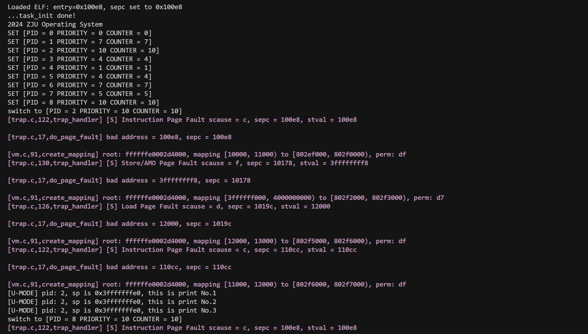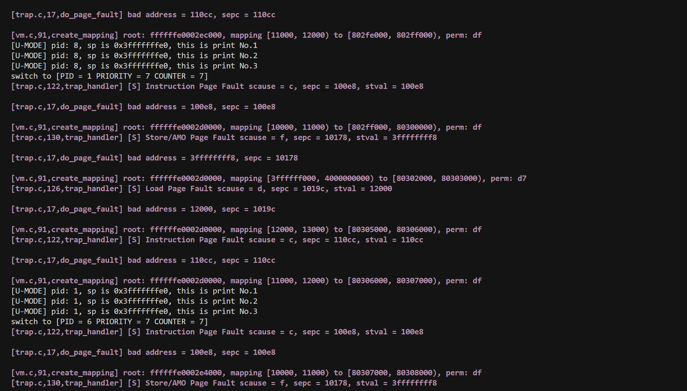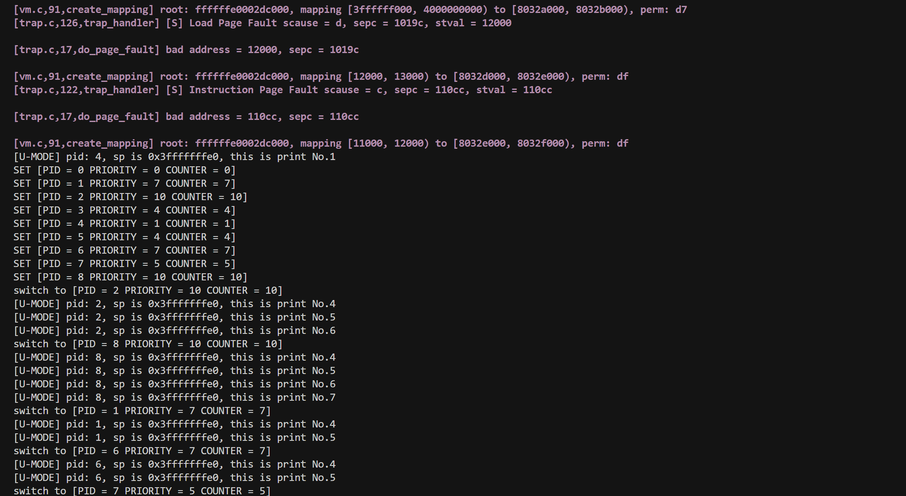
2. `make run TEST=PFH2`结果：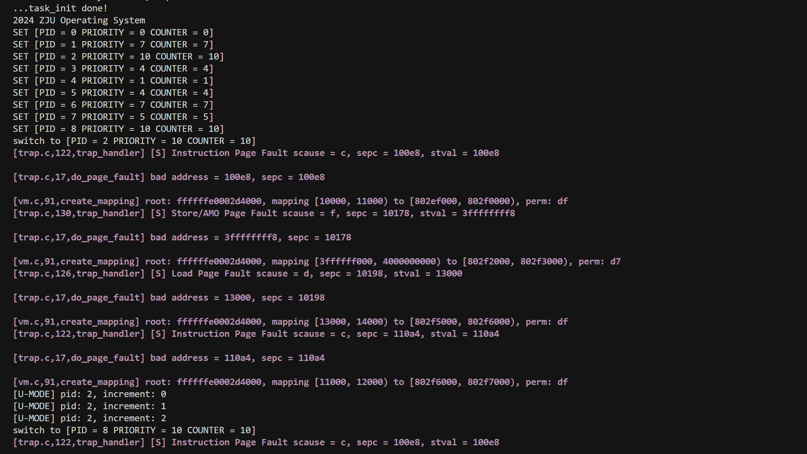可以看到和PFH相比，进程分配页时空出了一页(`[12000-13000]`)，符合测试预期
3. `make run TEST=FORK1`结果：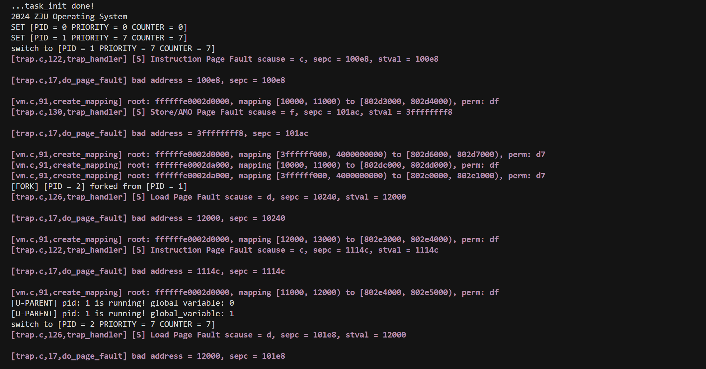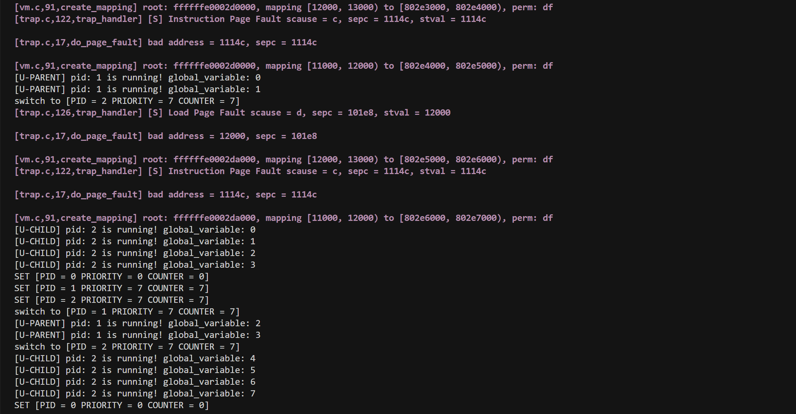
4. `make run TEST=FORK2`结果：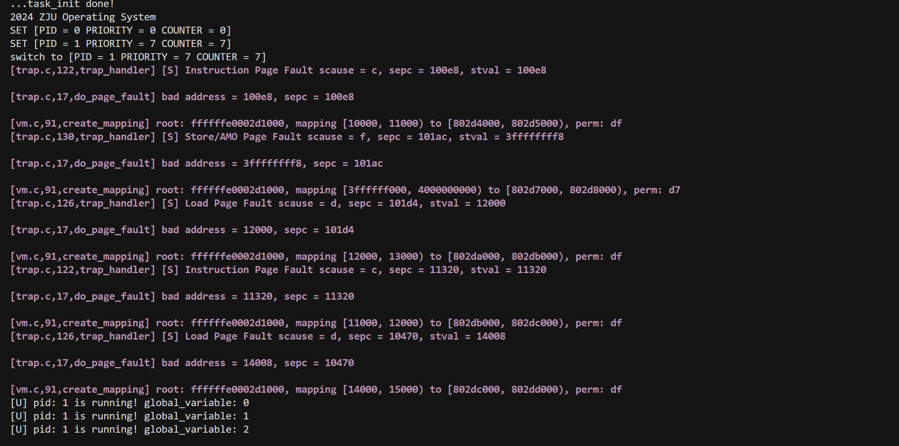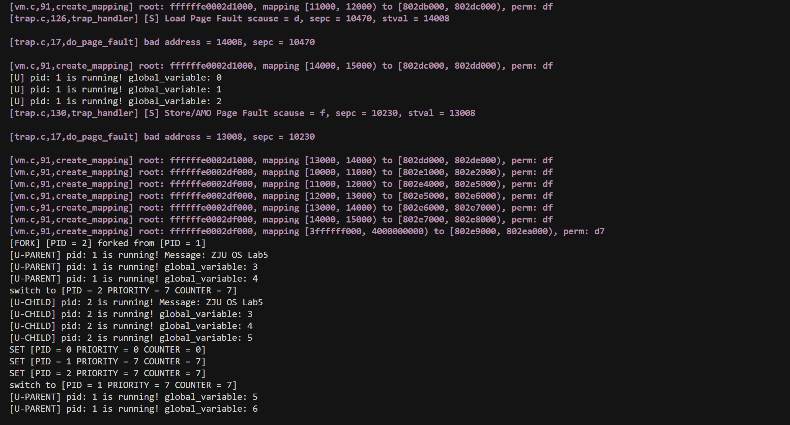
5. `make run TEST=FORK3`结果：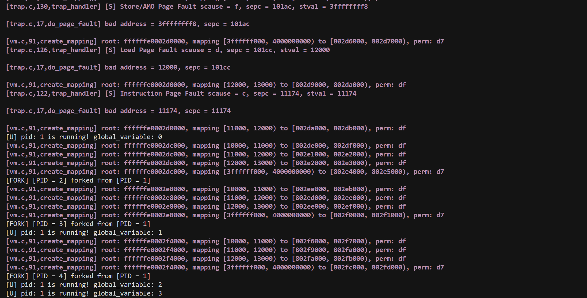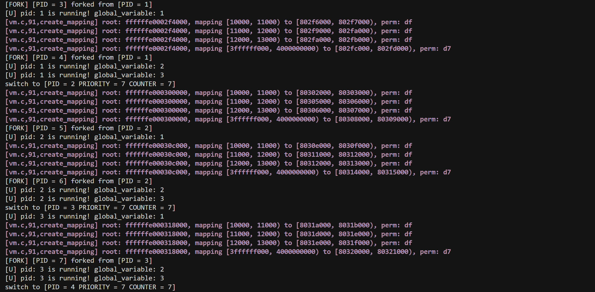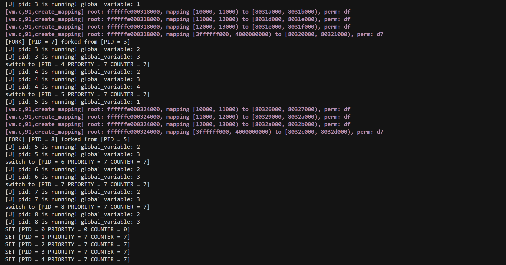


## 实验中遇到的问题及解决方法
实验中主要在两个地方卡了很久，一个是由于没有理解ELF拷贝区域的计算原理，整页拷贝导致过不了PFH2测试；另一个是对fork时父子进程的内核栈指针赋值理解有误，导致父子进程共享了内核栈，父进程后续被子进程覆盖。经过思考后一一解决了。

## 思考题与心得体会
### 思考题
1. **呈现出你在 page fault 的时候拷贝 ELF 程序内容的逻辑**：
   - 当判断决定需要进行ELF程序内容拷贝后，首先开辟一页内存，将其内容全部清零（因为如果后续计算得到这一页中不全是代码段，还包括`.bss`段的话，需要对相应区域置零，这里就提前代劳）；
   - 然后通过`bad_addr`和找到的`vma`中信息来得出需要实际进行复制的区域(计算bad_addr对齐后分配的一整页区域`[va_start, va_start + PGSIZE)`和文件数据区`[vma->vm_start, vma->vm_start + vma->vm_filesz)`的交集)，执行拷贝
   - 最后根据`bad_addr`和内存页地址，通过对齐、物理地址转换等操作获得相应的信息，完成映射
2. **回答 [4.3.5](#_12) 中的问题：**
    - **在 do_fork 中，父进程的内核栈和用户栈指针分别是什么**：父进程的内核栈指针存放在`regs->sp`中，用户栈指针在进入中断后被交换到`sscratch`寄存器中。
    - **在 do_fork 中，子进程的内核栈和用户栈指针的值应该是什么**：子进程的内核栈指针的值应为其内核栈顶地址（`(uint64_t)_task + PGSIZE`），用户栈指针的值应与父进程的用户栈指针相同
    - **在 do_fork 中，子进程的内核栈和用户栈指针分别应该赋值给谁**：子进程的内核栈指针应该赋给其`pt_regs->sp`，用户态指针应该赋给`_task->thread.sp`
3. **为什么要为子进程 `pt_regs` 的 `sepc` 手动加四**：因为父进程在调用完`fork()`后会返回到其下一条指令，而子进程在被调度后也要跳转到与父进程相同的位置继续执行，所以要手动加四跳过`fork()`系统调用。
4. **对于 `Fork main #2`（即 `FORK2`），在运行时，`ZJU OS Lab5` 位于内存的什么位置？是否在读取的时候产生了 page fault？请给出必要的截图以说明。**
   - `ZJU OS Lab5` 应该位于内存中`data`段存放的位置，读取的时候没有发生额外的页错误
5. **画图分析 `make run TEST=FORK3` 的进程 fork 过程，并呈现出各个进程的 `global_variable` 应该从几开始输出，再与你的输出进行对比验证。**
   - fork的顺序和关系大致如下图，一共会产生8个进程：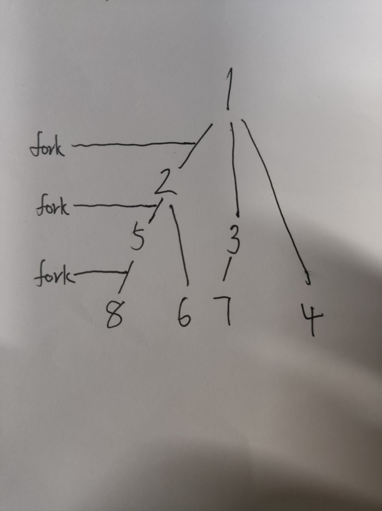
   - 子进程的`global_variable`应该从父进程执行fork前最后一次输出`global_variable`值的下一个数开始，例如下面：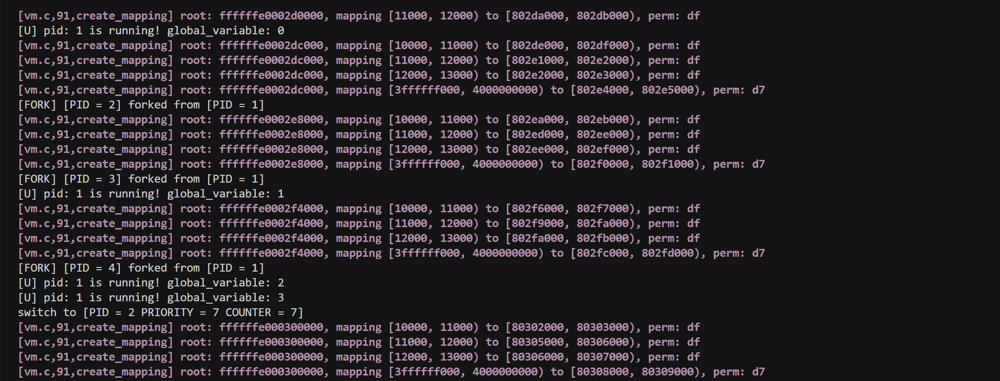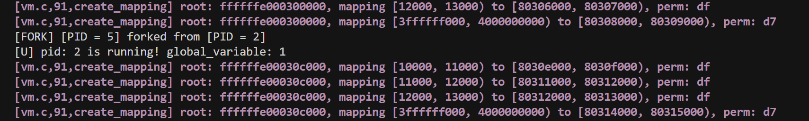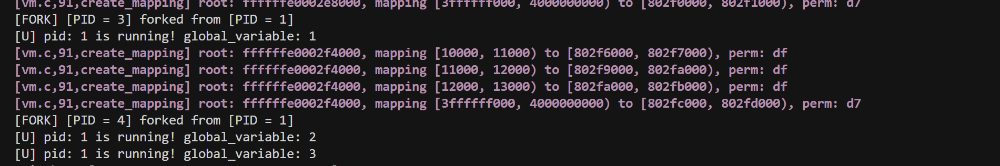进程1执行第一次和第二次fork前只输出了0，fork的进程2和进程3都从1开始输出；执行第三次fork前输出1，fork的进程4从2开始输出，以此类推。

### 心得体会
随着lab5验收成功，操作系统课程的实验对我来说就宣告完结了（补天来不及做lab6了，请老师和助教原谅orz）。在大学两年多的学习中，本课程的实验可以说是我见过实验指导最详尽、实验引导最科学、实践体验最好的，没有之一。由于操作系统较为底层，实验每年都在更新，因此求助AI是不可能的（本人尝试过，AI对于偏底层的知识理解完全不靠谱），参考前辈的代码也走不通，只能逼自己思考——调试——再思考——再调试。虽然过程很痛苦，但是因此收获的知识与成就感也是极为丰富的，很多在课堂上浅浅掠过的知识经过动手试错后都能理解得更深刻，对于操作系统的运行也有了更具象的感知。在此真的要感谢助教老师们对实验的构建与设计！
本人学艺不精，脑瓜有限，每一个实验都是连滚带爬地通过，最后的总评成绩大概率也不会好看，但是操作系统仍然是我本科专业学习期间最喜欢的课程之一。再次对寿老师和三位助教给予我的指导和帮助表达诚挚的感谢，同时也衷心祝愿操作系统课程实验越来越好！
